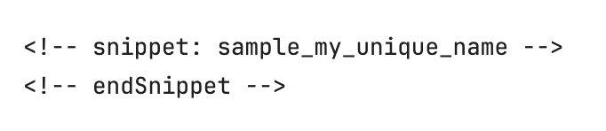

# Contributing to Marten

We take Pull Requests!

## Before you send Pull Request

1. Contact the contributors via the [Discord channel](https://discord.gg/WMxrvegf8H) or the [Github Issue](https://github.com/JasperFx/marten/issues/new) to make sure that this is issue or bug should be handled with proposed way. Send details of your case and explain the details of the proposed solution.
2. Once you get approval from one of the maintainers, you can start to work on your code change.
3. After your changes are ready, make sure that you covered your case with automated tests and verify that you have limited the number of breaking changes to a bare minimum.
4. We also highly appreciate any relevant updates to the documentation.
5. Make sure that your code is compiling and all automated tests are passing.

## After you have sent Pull Request

1. Make sure that you applied or answered all the feedback from the maintainers.
2. We're trying to be as much responsive as we can, but if we didn't respond to you, feel free to ping us on the [Discord channel](https://discord.gg/WMxrvegf8H).
3. Pull request will be merged when you get approvals from at least 2 of the maintainers (and no rejection from others). Pull request will be tagged with the target Marten version in which it will be released. We also label the Pull Requests with information about the type of change.

## Setup your work environment

We try to limit the number of necessary setup to a minimum, but few steps are still needed:

**1. .NET Core SDK 6.0+**

Available [here](https://dotnet.microsoft.com/download)

**2. PostgreSQL 13 or above database**

13 is a hard floor rather than a recommendation: the async daemon calls `pg_current_snapshot()`, which
arrived in PostgreSQL 13, so an older server fails those tests with
`42883: function pg_current_snapshot() does not exist`. CI runs `postgres:15-alpine` and
`postgres:latest`.

The fastest possible way to develop with Marten is to run PostgreSQL in a Docker container. Assuming that you have Docker running on your local box, type:
`docker compose up`
at the command line to spin up a PostgreSQL database. `docker-compose.yml` builds its image from
`docker/postgres/Dockerfile`, which layers PostGIS 3 and pgvector onto the official `postgres:17`
image so the extension test projects have what they need.

The default Marten test configuration finds that database automatically. To use a different one, set
the `marten_testing_database` environment variable to its connection string (see the
[Npgsql documentation](http://www.npgsql.org/doc/connection-string-parameters.html) for the format),
and make sure the login you connect with is a member of the `postgres` role.

Once you have the codebase and the connection string file, run the [build command](https://github.com/JasperFx/marten#build-commands) or use the dotnet CLI to restore and build the solution.

You are now ready to contribute to Marten.

**Node.js**

If you want to update or add new documentation, you need to have Node.js installed on your machine. The recommended version is the latest LTS version. You can download it from the [official website](https://nodejs.org/) or using a version manager like [nvm](https://github.com/nvm-sh/nvm).

After installing Node.js, you can install the required packages by running the following command in the root directory of this repository:

```bash
npm install
```

## Working with the Git

1. Fork the repository.
2. Create a feature branch from the `master` branch.
3. We're not squashing the changes and using rebase strategy for our branches (see more in [Git documentation](https://git-scm.com/book/en/v2/Git-Branching-Rebasing)). Having that, we highly recommend using clear commit messages. Commits should also represent the unit of change.
4. Before sending PR to make sure that you rebased the latest `master` branch from the main Marten repository.
5. When you're ready to create the [Pull Request on GitHub](https://github.com/JasperFx/marten/compare).

## Code style

Coding rules are set up in the [.editorconfig file](.editorconfig). This file is supported by all popular IDE (eg. Microsoft Visual Studio, Rider, Visual Studio Code) so if you didn't disable it manually they should be automatically applied after opening the solution. We also recommend turning automatic formatting on saving to have all the rules applied.

## Documentation

If you want to update or add new documentation, you can find the documentation in the `docs` directory.

We're using [MarkdownSnippets](https://github.com/SimonCropp/MarkdownSnippets) to include the C# code examples in the documentation.

If you want to add code examples to the documentation, you have to add a C# file which includes the code example or annotate existing files with a unique C# #region/#endregion pair:

```csharp
#region sample_my_unique_name
// Your code example here
#endregion
```

Then you can refer to the code example in the Markdown file by using the following syntax:



After adding the code example, you can run the following command to update the documentation:

```bash
npm run mdsnippets
```

You can find examples if you search this repository for "sample_" or "snippet:".

## Licensing and legal rights

By contributing to Marten:

1. You assert that contribution is your original work.
2. You assert that you have the right to assign the copyright for the work.
3. You are accepting the [License](LICENSE).

## Code of Conduct

This project has adopted the code of conduct defined by the [Contributor Covenant](http://contributor-covenant.org/) to clarify expected behavior in our community.
