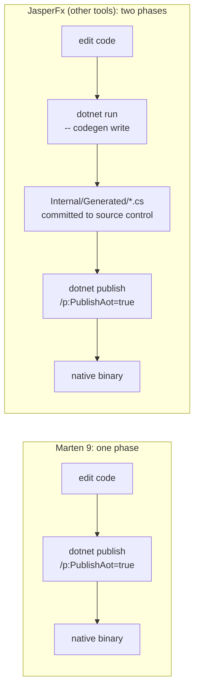

# Publishing Marten with Native AOT

This guide walks through publishing a Marten-backed .NET application with **Native AOT** (`dotnet publish /p:PublishAot=true`). Native AOT ahead-of-time-compiles the app to a self-contained native binary with no JIT and aggressive trimming, which means:

- **Startup is near-instant** — no JIT warmup, no Roslyn loading.
- **Publish size is small** — typically 15-40 MB self-contained, comparable to a Go binary.
- **No runtime code generation** — anything that needs `Reflection.Emit`, `Type.MakeGenericType`, or `Activator.CreateInstance(Type)` on a type the trimmer didn't statically see will warn at publish time and may fail at runtime.

Marten 9.0 is the first release where AOT publishing is a supported posture. The headline change: **Marten 9 retired its Roslyn-driven runtime code-generation pipeline entirely** (PR [#4461](https://github.com/JasperFx/marten/pull/4461) — "Removing All Runtime Compilation From Marten"). The document-storage, event-storage, compiled-query, and secondary-store paths now ship as hand-written closed-shape code or as compile-time source-generated output. There is no `dotnet run -- codegen write` step for Marten anymore.

AOT publishing is the right choice for serverless / Lambda / fast-restart workloads. It is **not** required for every Marten app — JIT publishes still work fine, and the dev-loop trade-offs (longer publish times, stricter analyzer policy) mean AOT only pays off when cold-start latency or binary size matters.

::: tip Prerequisites

- .NET 9 or .NET 10 SDK
- Marten 9.0.0-alpha or later
- JasperFx 2.0 / JasperFx.Events 2.0 / Weasel 9.0 alphas pulled in transitively when you bump `Marten`
- The System.Text.Json-based serializer (`UseSystemTextJsonForSerialization`) — Newtonsoft.Json is not AOT-compatible (see [The Newtonsoft.Json escape hatch](#the-newtonsoftjson-escape-hatch))
- `Marten.SourceGenerator` if you use compiled queries — see the [Marten.SourceGenerator README](https://github.com/JasperFx/marten/blob/master/src/Marten.SourceGenerator/README.md)

:::

## How Marten 9 differs from the broader Critter Stack AOT story

The [JasperFx AOT publishing guide](https://github.com/JasperFx/jasperfx/blob/main/docs/codegen/aot.md) describes a **two-phase model** where dev-time `dotnet run -- codegen write` produces pre-built `Internal/Generated/*.cs` files that the publish-time AOT compile then consumes. **That two-phase model does not apply to Marten 9.**



Marten's storage / projection / compiled-query surfaces all build their dispatchers **at compile time** (via `Marten.SourceGenerator` and `JasperFx.Events.SourceGenerator`) or are **hand-written closed-shape code** that ships in `Marten.dll` directly. The runtime never invokes Roslyn. As a result:

- **No `dotnet run -- codegen write` step.** If you have an `Internal/Generated/` folder committed from a pre-9.0 Marten app, delete it and remove it from `.gitignore`. Nothing reads or writes those files.
- **No `services.AddRuntimeCompilation()` call.** PR [#4461](https://github.com/JasperFx/marten/pull/4461) ripped out the runtime-codegen seam entirely. Don't add it back.
- **`StoreOptions.GeneratedCodeMode`, `AllowRuntimeCodeGeneration`, `SourceCodeWritingEnabled`, `GeneratedCodeOutputPath`** have been deleted entirely — references to them will fail to compile against Marten 9.0. Remove any leftover assignments from your bootstrapping. `StoreOptions.ApplicationAssembly` survives because `AutoRegister` and `TryUseSourceGeneratedDiscovery` still use it as a scan hint.

If you have a Wolverine app sitting next to your Marten app in the same composition root, the Wolverine side **does** still use the JasperFx two-phase model — Wolverine retains runtime codegen as an opt-in seam ([per the 2026 plan](https://github.com/JasperFx/jasperfx/issues/217)). The JasperFx guide is the authoritative reference for the Wolverine half of that story.

## Project setup walkthrough

### 1. Configure your csproj

```xml
<Project Sdk="Microsoft.NET.Sdk">

    <PropertyGroup>
        <OutputType>Exe</OutputType>
        <TargetFramework>net10.0</TargetFramework>
        <IsAotCompatible>true</IsAotCompatible>
        <PublishAot>true</PublishAot>

        <!-- Recommended: fail the publish build on any new IL warning -->
        <WarningsAsErrors>IL2026;IL2046;IL2055;IL2065;IL2067;IL2070;IL2072;IL2075;IL2090;IL2091;IL2111;IL3050;IL3051</WarningsAsErrors>
    </PropertyGroup>

    <ItemGroup>
        <PackageReference Include="Marten" />

        <!-- Optional but recommended: compile-time source generator for ICompiledQuery<TDoc, TOut> types -->
        <PackageReference Include="Marten.SourceGenerator" PrivateAssets="all" />
    </ItemGroup>

</Project>
```

Key points:

- **`IsAotCompatible=true`** turns on the IL2026 / IL2070 / IL2075 / IL3050 analyzers so any new reflective surface in *your* code surfaces at compile time.
- **`PublishAot=true`** triggers Native AOT at publish.
- **`WarningsAsErrors=IL...`** is the policy enforcer — without it the analyzer warnings are easy to lose in build noise. The list above mirrors what the [Marten.AotSmoke consumer in CI](https://github.com/JasperFx/marten/tree/master/src/Marten.AotSmoke) uses.
- **No `JasperFx.RuntimeCompiler` reference, no `Microsoft.CodeAnalysis.*` references** are needed. Marten 9 doesn't pull them in.

### 2. Configure `AddMarten` for the AOT-clean serializer

```csharp
var builder = Host.CreateApplicationBuilder(args);

builder.Services.AddMarten(opts =>
{
    opts.Connection(builder.Configuration.GetConnectionString("Marten")!);

    // System.Text.Json is the AOT-compatible serializer. The default options
    // are fine for most apps; pass an explicit JsonSerializerContext via the
    // configure callback if you need source-generated STJ as well.
    opts.UseSystemTextJsonForSerialization();

    // Register your document types, events, and projections as usual.
    opts.Schema.For<Invoice>();
    opts.Events.AddEventType<InvoiceCreated>();
    opts.Projections.Add<InvoiceSummaryProjection>(ProjectionLifecycle.Inline);
});

using var host = builder.Build();
await host.RunAsync();
```

### 3. Add the `[JasperFxAssembly]` marker (if you use compiled queries)

If your assembly declares any `ICompiledQuery<TDoc, TOut>` types, add the assembly-level marker that opts `Marten.SourceGenerator` into emitting handler code for them:

```csharp
// AssemblyInfo.cs (or any file in the assembly)
[assembly: JasperFx.JasperFxAssembly]
```

With the `Marten.SourceGenerator` package reference and `[JasperFxAssembly]` both present, every compiled query in the assembly gets a generator-emitted handler that registers itself with Marten's runtime registry via a `[ModuleInitializer]` at module load. No reflection, no FastExpressionCompiler, no Roslyn — just direct property/field reads compiled into your assembly.

See the [Marten.SourceGenerator README](https://github.com/JasperFx/marten/blob/master/src/Marten.SourceGenerator/README.md) for the full opt-in story and the three shapes the generator skips (where the runtime falls back to a `FastExpressionCompiler`-built descriptor — still no Roslyn, but the warning surface is wider).

### 4. Publish

```bash
dotnet publish -c Release /p:PublishAot=true -r linux-x64 -o ./publish
```

A successful publish produces a single self-contained binary (plus a few native dependency `.so` / `.dll` files) under `./publish`. The Roslyn graph is absent; the binary loads pre-generated source-generator output baked into the assembly directly.

## What works, what doesn't

As of Marten 9.0.0-alpha:

### Works (AOT-clean)

- **`UseSystemTextJsonForSerialization`** with the default `JsonSerializerOptions` or a user-supplied one. For best AOT results, pass a source-generated `JsonSerializerContext`.
- **Document storage** — `Schema.For<TDoc>()` and the entire CRUD / LINQ surface for closed-shape document types (Guid / string / int / long / strong-typed Id strategies).
- **Event storage** — `StartStream`, `Append`, `FetchStream`, `FetchStreamStateAsync`, the async daemon.
- **Projections** — `SingleStreamProjection<TDoc, TId>`, `MultiStreamProjection<TDoc, TId>`, `EventProjection`, `CustomProjection`, and `EventApplier` — the JasperFx.Events source generator emits `[GeneratedEvolver]` dispatchers at compile time for each registration. Marten calls `Options.Projections.DiscoverGeneratedEvolvers(...)` at startup (`src/Marten/DocumentStore.cs:84`) to pick them up.
- **Compiled queries** registered through `Marten.SourceGenerator` in an assembly marked `[JasperFxAssembly]`.
- **Secondary stores** registered via `services.AddMartenStore<TInterface>()` — Marten 9 builds the implementation type via `System.Reflection.Emit` (PR [#4459](https://github.com/JasperFx/marten/pull/4459)). The trimmer warning at the emit site carries a `[RequiresDynamicCode]` annotation; published apps that use this surface can either suppress or rely on the runtime fall-through to keep working.
- **`Marten.AspNetCore`** streaming endpoints (`WriteArray`, `StreamMany`, `WriteSingle`, etc.) — clean.
- **`Marten.NodaTime`** type handlers — clean.
- **`Marten.EntityFrameworkCore`** projection storage — clean once your `TDoc` / `TDbContext` consumer types satisfy the wrapper's `[DynamicallyAccessedMembers]` annotations (closing the generic parameters with concrete entity types and DbContext subclasses satisfies this implicitly).

### Annotated (warns at AOT publish without suppression)

- **`StoreOptions.MemberFactory`** — uses FastExpressionCompiler internally for property accessor delegates. Reached at registration time, not per-call. AOT consumers either accept the warning at the registration call site or wrap it with `[UnconditionalSuppressMessage]`.
- **`FSharpTypeHelper`** — same pattern; FEC for F# discriminated-union member access. Only reached if you actually register F# types.
- **LINQ queries with complex transforms** — the per-call LINQ-to-SQL translation uses runtime expression handling that the trim analyzer flags. For hot-path queries, route through `Marten.SourceGenerator`-emitted compiled queries to escape the warning.
- **The closed-shape `IIdentification` / `IDocumentBinder` construction sites** — every `Identification` / `Binder` / `BulkLoader` in `Marten.Internal.ClosedShape.*` reaches `LambdaBuilder.Getter` / `Setter` from FEC at registration time. Marten's class-level `[UnconditionalSuppressMessage]` justifications hide these at build time, but `dotnet publish /p:PublishAot=true` walks the full reachable graph and surfaces them. Tracked on the Marten 9 master plan (#4349) — the path forward is a per-document-type source-generator extension; until that lands, AOT-publishing apps will see ~15 `IL2026` / `IL3050` warnings cascading from these sites.

### Doesn't work in AOT

- **`Marten.Newtonsoft`** — Newtonsoft.Json is fundamentally AOT-hostile. The package's csproj deliberately leaves `IsAotCompatible` off (see PR [#4468](https://github.com/JasperFx/marten/pull/4468)). Use `UseSystemTextJsonForSerialization` instead.
- **`services.AddRuntimeCompilation()`** — the seam doesn't exist in Marten 9. If you have it in your composition root from a pre-9 app, delete the call.
- **Pre-built `Internal/Generated/`** — irrelevant to Marten 9. Delete the folder.

## The Newtonsoft.Json escape hatch

If your existing app uses `Marten.Newtonsoft`, the AOT migration is:

```csharp
// Before
services.AddMarten(opts =>
{
    opts.Connection(connectionString);
    opts.UseNewtonsoftForSerialization();  // ← not AOT-compatible
});

// After
services.AddMarten(opts =>
{
    opts.Connection(connectionString);
    opts.UseSystemTextJsonForSerialization();  // ← AOT-compatible
});
```

Things to watch when switching:

- **JSON property casing** — STJ defaults to `camelCase` for properties; Newtonsoft typically defaults to PascalCase. Override with `JsonSerializerOptions { PropertyNamingPolicy = null }` if your existing on-disk JSON uses PascalCase keys.
- **Enum handling** — `EnumStorage.AsString` works in both; STJ uses the `JsonStringEnumConverter` under the hood.
- **Polymorphic types** — STJ requires `[JsonDerivedType]` annotations or a source-gen `JsonSerializerContext` for type hierarchies. Newtonsoft's `TypeNameHandling` doesn't have a direct equivalent in STJ.
- **`DateTime` formatting** — STJ uses round-trip ISO-8601 by default; if your stored JSON was emitted by Newtonsoft with non-default settings, double-check the read path.

You can mix the two at the document level — register one document type with one serializer and another with a different one — but the AOT publish requires the STJ path to be the active one for the document types reached by your AOT-published code paths.

## Verifying your app is AOT-clean

After a publish, scan the build output for `IL2026` / `IL2070` / `IL2075` / `IL3050`:

```bash
dotnet publish -c Release /p:PublishAot=true -r linux-x64 -o ./publish 2>&1 | grep -E "warning IL|error IL"
```

Every warning carries the source location of the offending call. The fix path depends on the source:

| Source | Action |
| --- | --- |
| Marten core surface (e.g., `Marten.Internal.ClosedShape.*`) | Track in #4349; suppress at the consumer call site if you must publish today, with a justification comment pointing at the master plan. |
| Your own code reaching `Type.GetType(string)` / `MakeGenericType` / `Activator.CreateInstance(Type)` | Refactor to source-generated code, or add `[DynamicallyAccessedMembers]` to the relevant `Type` parameter. |
| A third-party reflection-based library | Same approach as above — annotate the wrapper, or migrate to a source-generated alternative. |

For a baseline confidence check, Marten ships [`src/Marten.AotSmoke/`](https://github.com/JasperFx/marten/tree/master/src/Marten.AotSmoke) — a tiny app that consumes the AOT-clean cross-section of Marten's surface with all the IL warning codes promoted to errors. Mirror its csproj setup in your own app, scoped to the Marten surface you actually use.

## Troubleshooting

### "No source-generated dispatcher found for aggregate `X`"

JasperFx.Events.SourceGenerator only picks up projection types that the consuming assembly references at compile time and that follow the discovered method-signature conventions (`Apply` / `Create` / `Evolve` shapes documented on each projection base type's xmldoc). If a projection is missing from `DiscoveredEvolvers`:

- Confirm the assembly with `services.AddMarten(opts => opts.Projections.Add<MyProjection>(...))` references `JasperFx.Events.SourceGenerator` either directly or transitively through `Marten`. Marten core already wires it; you should not need a separate reference unless you're cross-assembly.
- Confirm the projection extends `SingleStreamProjection<,>`, `MultiStreamProjection<,>`, or `EventProjection` (not a custom base type the generator doesn't know about).
- Re-run a clean build (`dotnet build -c Release --no-incremental`); source generators run at compile time and the output is in `obj/`, so a stale build can mask new registrations.

### `IL3050` warning on a custom projection base type

The source generator skips base types it doesn't recognize. If you wrote a custom projection base, either:

- Inherit from `SingleStreamProjection<,>` / `MultiStreamProjection<,>` / `EventProjection` instead and let the source generator emit the dispatch, or
- Implement `IProjection.ApplyAsync` directly with no reflection (the type-switch fallback) — slower but AOT-clean by construction.

### LINQ query throwing in AOT mode

Marten's runtime LINQ path uses expression-tree walking that the trim analyzer flags. The supported AOT pattern is:

1. Wrap the query in an `ICompiledQuery<TDoc, TOut>`.
2. Reference `Marten.SourceGenerator` and add `[assembly: JasperFx.JasperFxAssembly]`.
3. Call the compiled-query handler via `session.QueryAsync(compiledQueryInstance)`.

The compiled-query path bypasses the LINQ-to-SQL translator at runtime and dispatches directly through the source-generated handler. See [`Marten.SourceGenerator/README.md`](https://github.com/JasperFx/marten/blob/master/src/Marten.SourceGenerator/README.md) for the full surface.

### Secondary store throws `MissingMethodException` at boot

`AddMartenStore<TInterface>` uses `System.Reflection.Emit` to materialize the implementation type at runtime (Marten 9 ripped out the Roslyn-emit subclass path in PR [#4459](https://github.com/JasperFx/marten/pull/4459)). Native AOT supports `Reflection.Emit` only on full-AOT runtimes that include the JIT; some trimming configurations strip it. If a secondary store throws `MissingMethodException` at boot, check:

- Your published binary still contains `System.Reflection.Emit` (verify with `dotnet publish` output — it shouldn't be trimmed away).
- Your `TInterface` is exactly `: IDocumentStore` (no extra abstract members).

### `dotnet publish` is slow

Native AOT publish takes meaningfully longer than a JIT-mode publish (typically 30-90 seconds vs. a few seconds). Budget for it in your build pipeline; this is not a Marten-specific concern.

## Performance

Marten 9's source-generator-driven compiled-query path is meaningfully faster than the pre-9 runtime-codegen path on cold start. Per the [Marten.SourceGenerator README](https://github.com/JasperFx/marten/blob/master/src/Marten.SourceGenerator/README.md#status) measurements (taken before AOT publish):

- **Cold call** (first invocation, includes Marten pipeline setup): **codegen 75ms vs source-gen 3ms — ~25× faster**.
- **Steady-state per call** (200 calls amortized): **codegen 710μs vs source-gen 490μs — ~31% faster**.

Native AOT publish layers an additional speedup on top by eliminating JIT warmup entirely. End-to-end cold-start benchmarks for Marten 9 under AOT are tracked on the [Critter Stack scalability project](https://github.com/JasperFx/CritterStackScalability) and will be cited here once published.

## References

- [Master plan: Marten 9.0](https://github.com/JasperFx/marten/issues/4349)
- [AOT compliance pillar (JasperFx)](https://github.com/JasperFx/jasperfx/issues/213)
- [JasperFx AOT publishing guide](https://github.com/JasperFx/jasperfx/blob/main/docs/codegen/aot.md) — the broader Critter Stack story (Wolverine + the two-phase model)
- [Marten.SourceGenerator README](https://github.com/JasperFx/marten/blob/master/src/Marten.SourceGenerator/README.md) — the compiled-query AOT story
- [Migration Guide: Runtime code generation removed](/migration-guide#runtime-code-generation-removed) — the 8.x → 9.0 migration for the codegen pipeline
- [.NET trim warning reference](https://learn.microsoft.com/en-us/dotnet/core/deploying/trimming/trim-warnings/) — Microsoft's catalog of IL warning codes
- [.NET Native AOT documentation](https://learn.microsoft.com/en-us/dotnet/core/deploying/native-aot/) — official Microsoft guide
