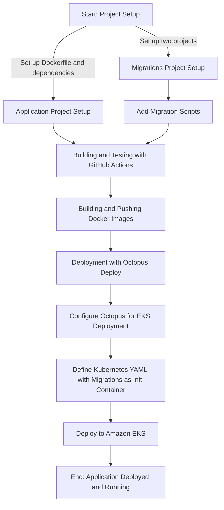

# DevOps with Marten: Setting Up a Dockerfile and Migrations

## Introduction

This guide will walk you through one approach to achieve DevOps with Marten. Specifically, we'll focus on setting up a Dockerfile and a separate project for database migrations. This is just one of many ways to integrate Marten into your DevOps processes. In this example set-up we are going through these steps:



## Prerequisites

- Docker installed on your machine
- Basic understanding of Marten and its CLI commands
- Two projects: `Application.csproj` and `Migrations.csproj`

## Migrations project set-up

Here's what your `Migrations.csproj` could look like:

```xml
<!-- needed to have an empty project without cs files -->
<Project Sdk="Microsoft.Build.NoTargets/3.7.0">
    <PropertyGroup>
        <!-- mandoditory, but meaningless -->
        <TargetFramework>net8.0</TargetFramework>
    </PropertyGroup>
    <ItemGroup>
        <None Include="scripts\**\*.sql">
            <CopyToOutputDirectory>PreserveNewest</CopyToOutputDirectory>
        </None>
    </ItemGroup>
</Project>
```

Note that this is just a shell project that does not contain any classes or code. But some prefer to be able to see the migrations scripts from within the solution. The project directory will contain a folder that contains the SQL scripts for the database migrations: `src\Migrations\scripts\up`

The dockerfile for the migration project does not build anything but uses [grate](https://erikbra.github.io/grate/):

```dockerfile
FROM erikbra/grate:1.5.4 as migrations

# Env Vars we need set at image runtime in order to control grate
ENV MIGRATIONS_CONNECTIONSTRING=""
ENV VERSION="0.0.0.1"

WORKDIR /app
RUN mkdir scripts
RUN mkdir migration-output
COPY "Migrations/scripts" "./scripts"

RUN addgroup -g 1001 -S nonroot && adduser -u 1001 -S nonroot -G nonroot
RUN chown -R nonroot:nonroot /app

USER nonroot

ENTRYPOINT ./grate \
    --files=./scripts \
    --databasetype postgresql \
    --connectionstring="$MIGRATIONS_CONNECTIONSTRING" \
    --version=$VERSION \
    --silent \
    --outputPath=./migration-output
```

Of course, it is fully up to you how you want to configure grate or if you want to use another migration tool altogether.

## Application project set-up

How you set-up your csproj is all up to you, but for this example you'll need to install the nuget package `Marten.CommandLine`, so we can export migrations to the migration project in a later step and pre generate code. Furthermore, the latest line in your `program.cs` needs to be:

```cs
return await app.RunOaktonCommands(args);
```

The dockerfile will include a step that writes the generated code by executing `dotnet run -- codegen write`. 

```dockerfile
FROM mcr.microsoft.com/dotnet/sdk:8.0-alpine AS build
WORKDIR /src

COPY ["Application/Application.csproj", "Application/"]

# you might need more projects  depending on your set-up
# COPY ["Shared/Shared.csproj", "Shared/"]

COPY . .
WORKDIR "/src/Application"

RUN dotnet run -- codegen write
RUN dotnet publish "Application.csproj" -c Release -o /app/publish /p:UseAppHost=false

FROM mcr.microsoft.com/dotnet/aspnet:8.0-alpine AS runtime
ENV DOTNET_RUNNING_IN_CONTAINER=1
ENV DOTNET_NOLOGO=1
ENV DOTNET_SKIP_FIRST_TIME_EXPERIENCE=1
RUN addgroup -g 1001 -S nonroot && adduser -u 1001 -S nonroot -G nonroot
RUN mkdir /app
RUN chown nonroot:nonroot /app
WORKDIR /app
COPY --chown=nonroot:nonroot --from=build /app/publish .

FROM runtime
EXPOSE 5000
USER nonroot
ENTRYPOINT ["dotnet", "Application.dll"]
```

## Add migration scripts

The migration scripts will be generated by the application. Afterwards, the scripts are moved to the migration project so that they are available for its Docker container.

One way is to add a file to the root of your project `migrations.bat` that contains:

```bat
dotnet run --project src/Application %*
```

Then depending on your situation you can do a full dump

```powershell
.\migrations marten-dump -d Marten ..\Migrations\scripts\up\202312101536_marten_initial_database.sql
```

Or a patch
```powershell
.\migrations marten-patch -d Marten ..\Migrations\scripts\up\2202312101536_patch1.sql
```

::: warning
These generated files are a good starting point, but always evaluate whether the output matches your database schema and migration strategy!
:::

## Building and Testing the Application from GitHub Actions

In this section, we'll discuss setting up GitHub Actions for building and testing an application that uses Marten for database operations. GitHub Actions is a CI/CD platform that allows you to automate your build, test, and deployment pipeline. The goal is to ensure every change made in the application is automatically built and tested, ensuring code quality and stability. This involves setting up workflows in GitHub Actions that handle different tasks such as building the application, running unit and integration tests, and potentially deploying the application.

### Setting Up the Workflow

1. **Workflow Trigger**: Define when the workflow should be triggered. Common triggers are on pull requests to the main branch or on workflow dispatch for manual triggers.

    ```yaml
    on: 
      pull_request:
        branches:
          - main
      workflow_dispatch:
    ```

2. **Environment Variables**: Set up environment variables used across the jobs in the workflow.

    ```yaml
    env:
      BUILD_CONFIGURATION: Release
      DOTNET_CLI_TELEMETRY_OPTOUT: true
      DOTNET_NOLOGO: true
      DOTNET_VERSION: 8.0.x
      PROJECT: fooproject
      SOLUTION: Application
    ```

3. **Build and Test Job**: This job will handle the building and testing of the application.

    - **Run on**: Specify the type of runner that the job will execute on, e.g., `ubuntu-latest`.
    - **Services**: Define services needed for the tests, like a PostgreSQL database.
    - **Steps**: 
        - Checkout the code.
        - Set up .NET environment.
        - Restore dependencies.
        - Build the application.
        - Run tests.

    Here's an example of how the job can be configured:

    ```yaml
    jobs:
      build-test:
        runs-on: ubuntu-latest
        services:
          postgres:
            image: postgres:16
            env:
              POSTGRES_USER: user
              POSTGRES_PASSWORD: password
            options: --health-cmd pg_isready --health-interval 10s --health-timeout 5s --health-retries 5
            ports:
              - 5432:5432

        steps:
          - name: Checkout
            uses: actions/checkout@v4

          - name: Setup .NET
            uses: actions/setup-dotnet@v3
            with:
              dotnet-version: ${{ env.DOTNET_VERSION }}

          - name: Dotnet restore
            run: dotnet restore ${{ env.SOLUTION }}.sln -verbosity:quiet

          - name: Build ${{ env.PROJECT }}
            run: dotnet build ${{ env.SOLUTION }}.sln -c ${{ env.BUILD_CONFIGURATION }} --no-restore

          - name: Test ${{ env.PROJECT }}
            run: dotnet test ${{ env.SOLUTION }}.sln -c ${{ env.BUILD_CONFIGURATION }} --no-restore --no-build --results-directory reports --logger "trx;" --nologo
    ```

4. **Report Generation**: Optionally, add steps to generate and publish test reports, which can be useful for analyzing test failures and maintaining test quality.

    ```dockerfile
        - uses: dorny/test-reporter@v1
            if: ${{ env.SKIP_TESTS == 'false' && (success() || failure()) }}
            with:
                name: Testreport
                path: "**/*.trx"
                reporter: dotnet-trx
                list-suites: 'failed'
                list-tests: 'failed'
    ```

5. **Integration with Other Tools**: If you're using tools like SonarQube for code quality analysis or Docker for containerization, integrate these into your workflow.

### Key Considerations

- **Secrets Management**: Ensure that any sensitive information like database passwords are stored as GitHub secrets and not hard-coded in the workflow file.
- **Workflow Optimization**: Consider caching dependencies and Docker layers to speed up the build process.
- **Fail Fast**: Configure your workflow to fail fast on errors to avoid unnecessary resource consumption.

By following these steps, you can establish a robust CI/CD pipeline using GitHub Actions, ensuring that your application with Marten integration is always in a deployable state.

## Building and Pushing Docker Images

After setting up the GitHub Actions for building and testing the application, the next step is to build and push the Docker images. This process is essential for packaging your application and its dependencies into a Docker container, which can then be deployed to any environment that supports Docker.

The aim is to create Docker images for both the application and the migrations project. These images will then be pushed to a Docker registry such as Docker Hub, GitHub Container Registry, or any other registry of your choice.

## Adding Docker Build and Push Steps to GitHub Actions

### 1. Defining the Docker Build Step

Include a step in your GitHub Actions workflow to build the Docker image using the `Dockerfile`. You need to build images for both the application and the migrations project.

For the application:
```yaml
- name: Build Application Docker Image
  run: docker build -t myapp/application:${{ github.sha }} -f ./Application/Dockerfile .
```

For the migrations project:
```yaml
- name: Build Migrations Docker Image
  run: docker build -t myapp/migrations:${{ github.sha }} -f ./Migrations/Dockerfile .
```

### 2. Logging into Docker Registry

Before you can push images to a registry, you need to log in. This step typically involves setting up secrets in your GitHub repository to store your Docker registry credentials.

```yaml
- name: Login to Docker Hub
  uses: docker/login-action@v1
  with:
    username: ${{ secrets.DOCKER_HUB_USERNAME }}
    password: ${{ secrets.DOCKER_HUB_ACCESS_TOKEN }}
```

### 3. Pushing the Docker Images

After building the images and logging into the Docker registry, push the images to the registry.

For the application:
```yaml
- name: Push Application Docker Image
  run: docker push myapp/application:${{ github.sha }}
```

For the migrations project:
```yaml
- name: Push Migrations Docker Image
  run: docker push myapp/migrations:${{ github.sha }}
```

## Adding to the GitHub Actions Workflow

These steps should be added to your existing GitHub Actions workflow, typically after the build and test steps, and optionally after any steps that perform additional verification or quality checks.

### Considerations

- **Tagging Strategy**: Consider how you will tag your Docker images. Using the Git SHA (as shown in the examples) is a common approach for uniqueness.
- **Security**: Be cautious with how you handle Docker registry credentials. Always use encrypted secrets.
- **Registry Choice**: The choice of Docker registry will depend on your project needs. It could be a public registry like Docker Hub or a private registry for more control.
- **Build Context**: Ensure that your Docker build context (the path specified at the end of the `docker build` command) is correct and includes all necessary files.

Incorporating these steps into your workflow will automate the process of building and pushing Docker images, making your deployment process more efficient and consistent.

## Deployment with Octopus Deploy and Amazon EKS

After building and pushing Docker images using GitHub Actions, the next phase is deployment. In this section, we'll discuss using Octopus Deploy for deployment orchestration and Amazon Elastic Kubernetes Service (EKS) for running the containers. We will also cover how to use the Migrations project as an init container in Kubernetes.

Octopus Deploy is a deployment automation tool that helps in deploying applications to various environments. Amazon EKS is a managed Kubernetes service which simplifies running Kubernetes on AWS. By integrating these tools, we can automate the deployment of our application and its associated database migrations.

### Prerequisites

- An Octopus Deploy server or cloud instance.
- A configured Amazon EKS cluster.
- Docker images for the application and migrations projects pushed to a Docker registry.

### Steps for Deployment

### 1. Setting Up Octopus Deploy

- **Create Environments**: Define different deployment environments like Development, Staging, and Production in Octopus.
- **Project Setup**: Create a new project in Octopus for your application.
- **Variables**: Define necessary variables, such as Docker image tags, AWS credentials, and any other required configurations.

### 2. Creating Deployment Process

- **Step to Deploy to EKS**: Add a step in Octopus to deploy the application to Amazon EKS. This step will reference the Docker image of your application.
- **Kubernetes YAML**: Prepare the Kubernetes deployment YAML file. This file should define the deployment, service, and any other Kubernetes resources required for your application.
  
For example, the deployment part of the YAML may look like:

```yaml
  apiVersion: apps/v1
  kind: Deployment
  metadata:
    name: myapp-deployment
  spec:
    replicas: 2
    selector:
      matchLabels:
        app: myapp
    template:
      metadata:
        labels:
          app: myapp
      spec:
        initContainers:
        - name: migrations
          image: myapp/migrations:${TAG} # TAG is dynamically replaced by Octopus
          env:
          - name: MIGRATIONS_CONNECTIONSTRING
            value: "YourDatabaseConnectionString"
        containers:
        - name: myapp
          image: myapp/application:${TAG} # TAG is dynamically replaced by Octopus
          ports:
          - containerPort: 80
```

### 3. Using Migrations as an Init Container

In the Kubernetes deployment YAML, define the migrations project Docker image as an init container. Init containers are specialized containers that run before app containers and are used to set up the environment for the application container.

- The init container should run the migrations necessary to set up or update the database schema.
- Ensure that the application container only starts after the successful completion of the init container.

### 4. Deploying to Amazon EKS

- **EKS Configuration**: Ensure that Octopus Deploy has access to your Amazon EKS cluster. This typically involves configuring AWS credentials and EKS cluster details in Octopus.
- **Running the Deployment**: Trigger the deployment in Octopus, which will apply the Kubernetes YAML to your EKS cluster, running both the migrations (as an init container) and the application.

### Considerations

- **Secrets Management**: Manage database connection strings and other sensitive information securely, possibly using Kubernetes secrets or external secret management tools.
- **Rollback Strategy**: Plan for a rollback strategy in case of deployment failures.
- **Monitoring and Logging**: Integrate monitoring and logging solutions to keep track of the application's health and performance.

By following these steps, you can automate the deployment of your application and its database migrations to Amazon EKS using Octopus Deploy, ensuring a smooth and consistent deployment process. Of course any deployment tool is allowed, for example from GitHub Actions itself.
