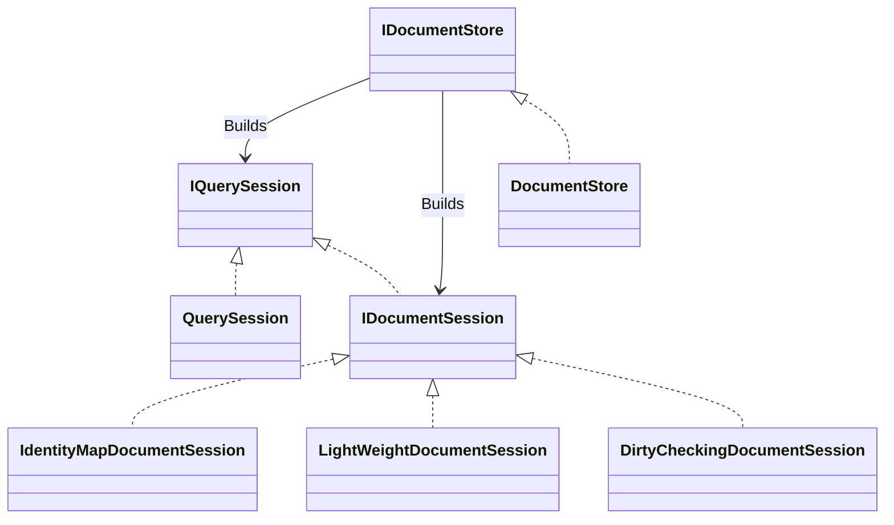

# Opening Sessions

`IDocumentStore` is the root of Marten usage, but most Marten usage in code will
start with one of the session types that can be created from an `IDocumentStore`. The following
diagram explains the relationship between the different flavors of session and the root store:



While there are sections below describing each session in more detail, at a high level the different
types of sessions are:

| **Creation**                                            | **Read/Write** | **Identity Map** | **Dirty Checking** |
| ------------------------------------------------------- | -------------- | ---------------- | ------------------ |
| `IDocumentStore.QuerySession()`                         | Read Only      | No               | No                 |
| `IDocumentStore.QuerySessionAsync()`                    | Read Only      | No               | No                 |
| `IDocumentStore.LightweightSession()`                   | Read/Write     | No               | No                 |
| `IDocumentStore.LightweightSerializableSessionAsync()`  | Read/Write     | No               | No                 |
| `IDocumentStore.IdentitySession()`                      | Read/Write     | Yes              | Yes                |
| `IDocumentStore.IdentitySerializableSessionAsync()`     | Read/Write     | Yes              | Yes                |
| `IDocumentStore.DirtyTrackedSession()`                  | Read/Write     | Yes              | Yes                |
| `IDocumentStore.DirtyTrackedSerializableSessionAsync()` | Read/Write     | Yes              | Yes                |
| `IDocumentStore.OpenSession()`                          | Read/Write     | Yes              | No                 |
| `IDocumentStore.OpenSerializableSessionAsync()`         | Read/Write     | Yes              | No                 |

::: tip INFO
The recommended session type for read/write operations is `LightWeightDocumentSession`, which gives the best performance. It does not do change tracking, which may not be needed for most cases.

For read-only access, use `QuerySession`.
:::

## Read Only QuerySession

For strictly read-only querying, the `QuerySession` is a lightweight session that is optimized
for reading. The `IServiceCollection.AddMarten()` configuration will set up a DI registration for
`IQuerySession`, so you can inject that into classes like this sample MVC controller:

<!-- snippet: sample_GetIssueController -->
<a id='snippet-sample_getissuecontroller'></a>
```cs
public class GetIssueController: ControllerBase
{
    private readonly IQuerySession _session;

    public GetIssueController(IQuerySession session)
    {
        _session = session;
    }

    [HttpGet("/issue/{issueId}")]
    public Task<Issue> Get(Guid issueId)
    {
        return _session.LoadAsync<Issue>(issueId);
    }

    [HttpGet("/issue/fast/{issueId}")]
    public Task GetFast(Guid issueId)
    {
        return _session.Json.WriteById<Issue>(issueId, HttpContext);
    }

}
```
<sup><a href='https://github.com/JasperFx/marten/blob/master/src/AspNetCoreWithMarten/IssueController.cs#L55-L80' title='Snippet source file'>snippet source</a> | <a href='#snippet-sample_getissuecontroller' title='Start of snippet'>anchor</a></sup>
<!-- endSnippet -->

If you have an `IDocumentStore` object though, you can open a query session like this:

<!-- snippet: sample_opening_querysession -->
<a id='snippet-sample_opening_querysession'></a>
```cs
using var store = DocumentStore.For(opts =>
{
    opts.Connection("some connection string");
});

await using var session = store.QuerySession();

var badIssues = await session.Query<Issue>()
    .Where(x => x.Tags.Contains("bad"))
    .ToListAsync();
```
<sup><a href='https://github.com/JasperFx/marten/blob/master/src/Marten.Testing/Examples/OpeningAQuerySession.cs#L11-L24' title='Snippet source file'>snippet source</a> | <a href='#snippet-sample_opening_querysession' title='Start of snippet'>anchor</a></sup>
<!-- endSnippet -->

## Async session for serializable transactions

Use `IDocumentStore.LightweightSerializableSessionAsync()` to Open a new `IDocumentSession` with the supplied options and immediately open the database connection and start the transaction for the session. This is appropriate for Serializable transaction sessions. This is added in v5.

<!-- snippet: sample_opening_session_async -->
<a id='snippet-sample_opening_session_async'></a>
```cs
await using var session =
    await store.LightweightSerializableSessionAsync(SessionOptions.ForConnectionString("another connection string"));

var openIssues = await session.Query<Issue>()
    .Where(x => x.Tags.Contains("open"))
    .ToListAsync();
```
<sup><a href='https://github.com/JasperFx/marten/blob/master/src/Marten.Testing/Examples/OpeningASessionAsync.cs#L17-L26' title='Snippet source file'>snippet source</a> | <a href='#snippet-sample_opening_session_async' title='Start of snippet'>anchor</a></sup>
<!-- endSnippet -->

## Identity Map Mechanics

**Identity Map:**

> Ensures that each object gets loaded only once by keeping every loaded object in a map. Looks up objects using the map when referring to them.
>
> -- <cite>[Martin Fowler](http://martinfowler.com/eaaCatalog/identityMap.html)</cite>

Marten's `IDocumentSession` implements the [_Identity Map_](https://en.wikipedia.org/wiki/Identity_map_pattern) pattern that seeks to cache documents loaded by id. This behavior can be very valuable, for example, in handling web requests or service bus messages when many different objects or functions may need to access the same logical document. Using the identity map mechanics allows the application to easily share data and avoid the extra database access hits -- as long as the `IDocumentSession` is scoped to the web request.

<!-- snippet: sample_using-identity-map -->
<a id='snippet-sample_using-identity-map'></a>
```cs
var user = new User { FirstName = "Tamba", LastName = "Hali" };
theStore.BulkInsert(new[] { user });

// Open a document session with the identity map
using var session = theStore.IdentitySession();
session.Load<User>(user.Id)
    .ShouldBeTheSameAs(session.Load<User>(user.Id));
```
<sup><a href='https://github.com/JasperFx/marten/blob/master/src/Marten.Testing/Examples/IdentityMapTests.cs#L10-L18' title='Snippet source file'>snippet source</a> | <a href='#snippet-sample_using-identity-map' title='Start of snippet'>anchor</a></sup>
<!-- endSnippet -->

Do note that using the identity map functionality can be wasteful if you aren't able to take advantage of the identity map caching in a session. In those cases, you may want to either use the `IDocumentStore.LightweightSession()` which forgos the identity map functionality, or use the read only `IQuerySession` alternative. RavenDb users will note that Marten does not (yet) support any notion of `Evict()` to manually remove documents from identity map tracking to avoid memory usage problems. Our hope is that the existence of the lightweight session and the read only interface will alleviate the memory explosion problems that you can run into with naive usage of identity maps or the dirty checking when fetching a large number of documents.

The Identity Map functionality is applied to all documents loaded by Id or Linq queries with `IQuerySession/IDocumentSession.Query<T>()`. **Documents loaded by user-supplied SQL in the `IQuerySession.Query<T>(sql)` mechanism bypass the Identity Map functionality.**

## Ejecting Documents from a Session

If for some reason you need to completely remove a document from a session's [identity map](/documents/identity) and [unit of work tracking](/documents/sessions), as of Marten 2.4.0 you can use the
`IDocumentSession.Eject<T>(T document)` syntax shown below in one of the tests:

<!-- snippet: sample_ejecting_a_document -->
<a id='snippet-sample_ejecting_a_document'></a>
```cs
var target1 = Target.Random();
var target2 = Target.Random();

using (var session = theStore.IdentitySession())
{
    session.Store(target1, target2);

    // Both documents are in the identity map
    session.Load<Target>(target1.Id).ShouldBeTheSameAs(target1);
    session.Load<Target>(target2.Id).ShouldBeTheSameAs(target2);

    // Eject the 2nd document
    session.Eject(target2);

    // Now that 2nd document is no longer in the identity map
    session.Load<Target>(target2.Id).ShouldBeNull();

    session.SaveChanges();
}

using (var session = theStore.QuerySession())
{
    // The 2nd document was ejected before the session
    // was saved, so it was never persisted
    session.Load<Target>(target2.Id).ShouldBeNull();
}
```
<sup><a href='https://github.com/JasperFx/marten/blob/master/src/DocumentDbTests/SessionMechanics/ejecting_documents.cs#L14-L41' title='Snippet source file'>snippet source</a> | <a href='#snippet-sample_ejecting_a_document' title='Start of snippet'>anchor</a></sup>
<!-- endSnippet -->

## Ejecting all pending changes from a Session

If you want to remove all queued operations such as document changes or event operations in an unit of work, you can use `IDocumentSession.EjectAllPendingChanges()`. Note that calling this method will not impact any existing identity map i.e. all document stores. Here is a sample from one of our tests:

<!-- snippet: sample_ejecting_all_document_changes -->
<a id='snippet-sample_ejecting_all_document_changes'></a>
```cs
theSession.Store(Target.Random());
theSession.Insert(Target.Random());
theSession.Update(Target.Random());

theSession.PendingChanges.Operations().Any().ShouldBeTrue();

theSession.EjectAllPendingChanges();

theSession.PendingChanges.Operations().Any().ShouldBeFalse();
```
<sup><a href='https://github.com/JasperFx/marten/blob/master/src/DocumentDbTests/SessionMechanics/ejecting_all_pending_changes.cs#L19-L29' title='Snippet source file'>snippet source</a> | <a href='#snippet-sample_ejecting_all_document_changes' title='Start of snippet'>anchor</a></sup>
<!-- endSnippet -->

## Connection Handling

::: tip
This behavior changed in Marten 7. And regardless of the new Marten 7 behavior or opting into the V6 and before "sticky"
connection handling, you almost certainly want connection pooling enabled (it is by default). 
:::

By default, Marten will only open a database connection within a session immediately before any operation that involves
a database connection, and closes that connection immediately after the operation is over (really just returning the underlying
connection to the connection pool managed by Npgsql). With this change, it is now safe to run read-only queries through
`IQuerySession` (or lightweight `IDocumentSession`) objects in multiple threads. That should make Marten be more effective
within [Hot Chocolate integrations](https://chillicream.com/docs/hotchocolate/v13).

There are some exceptions to this behavior:

1. When creating a session with an existing connection or transaction
2. When creating a session with serializable transaction isolation levels, the connection is opened immediately and sticky throughout. I.e., `IDocumentStore.******SerializableSessionAsync()`
3. When opting to have Marten enroll in ambient transactions (`SessionOptions.ForCurrentTransaction()`)
4. When choosing to use explicit transaction boundaries (see the next section)
5. When using the session's underlying connection for user defined querying.

::: info
This ability to directly access and use the session's connection was originally intended to make Marten easy to integrate
with [Dapper](https://github.com/DapperLib/Dapper).
:::

To the last point, using this code will quietly move the session to having a "sticky" connection:

<!-- snippet: sample_using_session_connection_directly -->
<a id='snippet-sample_using_session_connection_directly'></a>
```cs
public static async Task using_session_connection(IQuerySession session)
{
    // Accessing the session.Connection object will quietly open
    // a "sticky" connection for the session
    var openCount = await session.Connection

        // This is using a helper extension method from Weasel
        .CreateCommand("select count(*) from tasks where status = 'open'")
        .ExecuteScalarAsync();
}
```
<sup><a href='https://github.com/JasperFx/marten/blob/master/src/Marten.Testing/Examples/ExplicitTransactions.cs#L11-L24' title='Snippet source file'>snippet source</a> | <a href='#snippet-sample_using_session_connection_directly' title='Start of snippet'>anchor</a></sup>
<!-- endSnippet -->

You can register SQL statements to be executed as part of the `SaveChanges()` / `SaveChangesAsync()` batch and transaction through
`IDocumentSession.QueueSqlCommand()`, and the Marten team would recommend doing that as much as possible.

### Explicit Transaction Boundaries

::: warning
If you use this method, you will want to make sure the session is disposed to release the "sticky" connection.
:::

Sometimes you may want to start the transaction in a Marten session for making explicit commits through the session's
connection (with Dapper for example) or if you simply need to have consistent reads within the usage of the session 
by querying through an active transaction. In that case, your syntax is:

<!-- snippet: sample_explicit_transactions -->
<a id='snippet-sample_explicit_transactions'></a>
```cs
public static async Task explicit_transactions(IDocumentSession session)
{
    // If in synchronous code, but don't mix this in real async code!!!!
    session.BeginTransaction();

    // Favor this within async code
    await session.BeginTransactionAsync(CancellationToken.None);
}
```
<sup><a href='https://github.com/JasperFx/marten/blob/master/src/Marten.Testing/Examples/ExplicitTransactions.cs#L27-L38' title='Snippet source file'>snippet source</a> | <a href='#snippet-sample_explicit_transactions' title='Start of snippet'>anchor</a></sup>
<!-- endSnippet -->

### "Sticky" Connections

To revert Marten back to its V6 and earlier "sticky" connection handling, use this option:

<!-- snippet: sample_use_sticky_connection_lifetimes -->
<a id='snippet-sample_use_sticky_connection_lifetimes'></a>
```cs
using var store = DocumentStore.For(opts =>
{
    opts.Connection("some connection string");

    // Opt into V6 and earlier "sticky" connection
    // handling
    opts.UseStickyConnectionLifetimes = true;
});
```
<sup><a href='https://github.com/JasperFx/marten/blob/master/src/CoreTests/sticky_connection_mode.cs#L30-L41' title='Snippet source file'>snippet source</a> | <a href='#snippet-sample_use_sticky_connection_lifetimes' title='Start of snippet'>anchor</a></sup>
<!-- endSnippet -->

With this setting, Marten uses a single connection to the Postgresql database in each `IQuerySession` or `IDocumentSession`.
The connection is only opened on the first call to the database, but after that remains open until the `IQuerySession`/`IDocumentSession` is disposed. A couple things to note:

- It's imperative that any `IQuerySession`/`IDocumentSession` opened is disposed in order to recover and reuse
  connections to the underlying database
- Because the connection is "sticky" to the session, you can utilize serializable transactions. In the future, Marten will
  also enable you to opt into [locking documents read from the session](https://github.com/JasperFx/marten/issues/356).

There is no place within Marten where it keeps a stateful connection open across sessions.

## Command Timeouts

By default, Marten just uses the underlying timeout configuration from the [Npgsql connection string](http://www.npgsql.org/doc/connection-string-parameters.html).
You can though, opt to set a different command timeout per session with this syntax:

<!-- snippet: sample_ConfigureCommandTimeout -->
<a id='snippet-sample_configurecommandtimeout'></a>
```cs
public void ConfigureCommandTimeout(IDocumentStore store)
{
    // Sets the command timeout for this session to 60 seconds
    // The default is 30
    using (var session = store.LightweightSession(new SessionOptions { Timeout = 60 }))
    {
    }
}
```
<sup><a href='https://github.com/JasperFx/marten/blob/master/src/CoreTests/SessionOptionsTests.cs#L21-L32' title='Snippet source file'>snippet source</a> | <a href='#snippet-sample_configurecommandtimeout' title='Start of snippet'>anchor</a></sup>
<!-- endSnippet -->

## Unit of Work Mechanics

::: tip
The call to `IDocumentSession.SaveChanges()` tries to batch all the queued updates and deletes into a single ADO.Net call to PostgreSQL. Our testing has
shown that this technique is much faster than issuing one ADO.Net call at a time.
:::

At this point, the `IDocumentSession` is the sole [unit of work](http://martinfowler.com/eaaCatalog/unitOfWork.html) for transactional updates -- but that may change later as Marten outgrows its origin as a replacement for RavenDb. As [shown before](/documents/), document sessions come in three flavors (lightweight, identity map tracking, and identity map + dirty checking), but there are only two modes of change tracking:

1. Lightweight and the standard "identity map" sessions require users to do all the change tracking manually and tell the `IDocumentSession`
   what documents have changed
1. The "dirty checking" session tries to determine which documents loaded from that `IDocumentSession` has any changes when `IDocumentSession.SaveChanges()` is called

::: tip INFO
When using a `Guid`/`CombGuid`, `Int`, or `Long` identifier, Marten will ensure the identity is set immediately after calling `IDocumentSession.Store` on the entity.
:::

TODO -- Need to talk about SaveChanges / SaveChangesAsync here!

## Adding Listeners

See [Diagnostics and Instrumentation](/diagnostics) for information about using document session listeners.

## Enlisting in Existing Transactions

::: warning
Marten is unable to evaluate database migrations within a session that is created by enrolling in an ambient transaction
(`TransactionScope`). If you need to use ambient transactions, you will need to apply database changes upfront.
:::

Before Marten 2.4.0, a Marten `IDocumentSession` always controlled the lifecycle of its underlying database
connection and transaction boundaries. With the 2.4.0+ release, you can pass in an existing transaction or connection, direct
Marten to enlist in an ambient transaction scope, and even direct Marten on whether or not it owns the transaction boundaries
to override whether or not `SaveChanges/SaveChangesAsync` will commit the underlying transaction.

Do note that the transaction scope enlisting is only available in either the full .Net framework (> .Net 4.6) or applications targeting
Netstandard 2.0.

<!-- snippet: sample_passing-in-existing-connections-and-transactions -->
<a id='snippet-sample_passing-in-existing-connections-and-transactions'></a>
```cs
// Use an existing connection, but Marten still controls the transaction lifecycle
var session1 = store.LightweightSession(SessionOptions.ForConnection(connection));

// Enlist in an existing Npgsql transaction, but
// choose not to allow the session to own the transaction
// boundaries
var session3 = store.LightweightSession(SessionOptions.ForTransaction(transaction));

// Enlist in the current, ambient transaction scope
using var scope = new TransactionScope();
var session4 = store.LightweightSession(SessionOptions.ForCurrentTransaction());
```
<sup><a href='https://github.com/JasperFx/marten/blob/master/src/CoreTests/ability_to_use_an_existing_connection_and_transaction.cs#L35-L50' title='Snippet source file'>snippet source</a> | <a href='#snippet-sample_passing-in-existing-connections-and-transactions' title='Start of snippet'>anchor</a></sup>
<!-- endSnippet -->

## Transaction Isolation Level

The transaction isolation level when opening a new `IDocumentSession` can be configured by
supplying the optional `isolationLevel` argument. The default level is `ReadCommitted`.

As one of the use cases that spawned this feature, say that you are using the [Saga pattern](https://lostechies.com/jimmybogard/2013/03/21/saga-implementation-patterns-variations/) in a service bus architecture. When handling a message with this pattern, you typically want to load some kind of persisted state for the long running saga, do some work, then persist the updated saga state.

If you need to worry about serializing the messages for a single saga, you might want to use [serializable transactions](https://en.wikipedia.org/wiki/Serializability) like this:

<!-- snippet: sample_serializable-saga-transaction -->
<a id='snippet-sample_serializable-saga-transaction'></a>
```cs
public class MySagaState
{
    public Guid Id { get; set; }
}

public async Task execute_saga_serializable(IDocumentStore store, Guid sagaId, CancellationToken ct)
{
    // The session below will open its connection and start a
    // serializable transaction avoiding blocking calls
    await using var session = await store.LightweightSerializableSessionAsync(ct);
    var state = await session.LoadAsync<MySagaState>(sagaId, ct);

    // do some work against the saga

    await session.SaveChangesAsync(ct);
}
```
<sup><a href='https://github.com/JasperFx/marten/blob/master/src/Marten.Testing/Examples/SagaStorageExample.cs#L10-L29' title='Snippet source file'>snippet source</a> | <a href='#snippet-sample_serializable-saga-transaction' title='Start of snippet'>anchor</a></sup>
<!-- endSnippet -->

You may also specify other [transaction isolation level supported by PostgreSQL](https://www.postgresql.org/docs/current/transaction-iso.html):

<!-- snippet: sample_saga-transaction -->
<a id='snippet-sample_saga-transaction'></a>
```cs
public async Task execute_saga(IDocumentStore store, Guid sagaId, CancellationToken ct)
{
    // The session below will open its connection and start a
    // snapshot transaction
    await using var session = store.LightweightSession(IsolationLevel.Snapshot);
    var state = await session.LoadAsync<MySagaState>(sagaId, ct);

    // do some work against the saga

    await session.SaveChangesAsync(ct);
}
```
<sup><a href='https://github.com/JasperFx/marten/blob/master/src/Marten.Testing/Examples/SagaStorageExample.cs#L31-L45' title='Snippet source file'>snippet source</a> | <a href='#snippet-sample_saga-transaction' title='Start of snippet'>anchor</a></sup>
<!-- endSnippet -->

## Manual Change Tracking

The first step is to create a new `DocumentSession` with the `IDocumentStore.LightweightSession()`:

<!-- snippet: sample_lightweight_document_session_uow -->
<a id='snippet-sample_lightweight_document_session_uow'></a>
```cs
await using var session = store.LightweightSession();
var user = new User { FirstName = "Jeremy", LastName = "Miller" };

// Manually adding the new user to the session
session.Store(user);

var existing = session.Query<User>().Single(x => x.FirstName == "Max");
existing.Internal = false;

// Manually marking an existing user as changed
session.Store(existing);

// Marking another existing User document as deleted
session.Delete<User>(Guid.NewGuid());

// Persisting the changes to the database
await session.SaveChangesAsync();
```
<sup><a href='https://github.com/JasperFx/marten/blob/master/src/Marten.Testing/Examples/UnitOfWorkMechanics.cs#L12-L30' title='Snippet source file'>snippet source</a> | <a href='#snippet-sample_lightweight_document_session_uow' title='Start of snippet'>anchor</a></sup>
<!-- endSnippet -->

Do note that Marten's `Store()` method makes no distinctions between inserts and updates. The Postgresql functions generated by Marten to update the document storage tables perform "upserts" for you. Anytime a document is registered through `IDocumentSession.Store(document)`, Marten runs the "auto-assignment" policy for the id type of that document. See [identity](/documents/identity) for more information on document id's.

## Automatic Dirty Checking Sessions

In the case an `IDocumentSession` opened with the dirty checking enabled, the session will try to detect changes to any of the documents loaded by that
session. The dirty checking is done by keeping the original JSON fetched from Postgresql and using Newtonsoft.Json to do a node by node comparison of the
JSON representation of the document at the time that `IDocumentSession` is called.

<!-- snippet: sample_tracking_document_session_uow -->
<a id='snippet-sample_tracking_document_session_uow'></a>
```cs
await using var session = store.DirtyTrackedSession();
var user = new User { FirstName = "Jeremy", LastName = "Miller" };

// Manually adding the new user to the session
session.Store(user);

var existing = session.Query<User>().Single(x => x.FirstName == "Max");
existing.Internal = false;

// Marking another existing User document as deleted
session.Delete<User>(Guid.NewGuid());

// Persisting the changes to the database
await session.SaveChangesAsync();
```
<sup><a href='https://github.com/JasperFx/marten/blob/master/src/Marten.Testing/Examples/UnitOfWorkMechanics.cs#L35-L50' title='Snippet source file'>snippet source</a> | <a href='#snippet-sample_tracking_document_session_uow' title='Start of snippet'>anchor</a></sup>
<!-- endSnippet -->

Do be aware that the automated dirty checking comes with some mechanical cost in memory and runtime performance.
