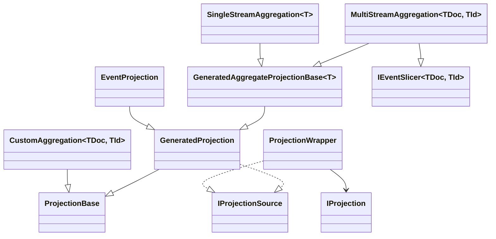

# Aggregate Projections

_Aggregate Projections_ in Marten combine some sort of grouping of events and process them to create a single
aggregated document representing the state of those events. To jump into a simple example, here's a simple aggregated
view called `QuestParty` that creates an aggregated view of `MembersJoined`, `MembersDeparted`, and `QuestStarted` events related to a group of heroes traveling on a quest in your favorite fantasy novel:

<!-- snippet: sample_QuestParty -->
<a id='snippet-sample_questparty'></a>
```cs
public class QuestParty
{
    public List<string> Members { get; set; } = new();
    public IList<string> Slayed { get; } = new List<string>();
    public string Key { get; set; }
    public string Name { get; set; }

    // In this particular case, this is also the stream id for the quest events
    public Guid Id { get; set; }

    // These methods take in events and update the QuestParty
    public void Apply(MembersJoined joined) => Members.Fill(joined.Members);
    public void Apply(MembersDeparted departed) => Members.RemoveAll(x => departed.Members.Contains(x));
    public void Apply(QuestStarted started) => Name = started.Name;

    public override string ToString()
    {
        return $"Quest party '{Name}' is {Members.Join(", ")}";
    }
}
```
<sup><a href='https://github.com/JasperFx/marten/blob/master/src/EventSourcingTests/Projections/QuestParty.cs#L8-L30' title='Snippet source file'>snippet source</a> | <a href='#snippet-sample_questparty' title='Start of snippet'>anchor</a></sup>
<!-- endSnippet -->

Once again, here's the class diagram of the key projection types inside of Marten, but please note the `SingleStreamAggregation<T>`:



Marten supports a few different types of aggregated projections:

* **Single Stream Aggregates** -- creating a rolled up view of all or a segment of the events within an event stream. This is done through either a _self-aggregate_ or by using `AggregateStream<T>` as a base class for your projection.
* **Multi Stream Aggregates** -- creating a rolled up view of a user-defined grouping of events across streams. These projections are done by sub-classing the `MultiStreamAggregation<TDoc, TId>` class and is further described in [View Projections](/events/projections/view-projections).

Please note that all aggregated projections share the same set of method conventions described in this page.

## Aggregate by Stream

::: tip
Projection types and the associated aggregate types need to be scoped as public because of Marten's internal code generation techniques. Some methods
discovered by the method conventions can be internal or private, but the holding type must be public.
:::

The easiest type of aggregate to create is a document that rolls up the state of a single event stream. You can do that by either creating a public aggregate
document that directly mutates itself through method conventions or by sub-classing the `AggregateProjection<T>` class like this sample for a fictional `Trip` aggregate document:

<!-- snippet: sample_TripProjection_aggregate -->
<a id='snippet-sample_tripprojection_aggregate'></a>
```cs
public class TripProjection: SingleStreamAggregation<Trip>
{
    public TripProjection()
    {
        DeleteEvent<TripAborted>();

        DeleteEvent<Breakdown>(x => x.IsCritical);

        DeleteEvent<VacationOver>((trip, v) => trip.Traveled > 1000);

        // Now let's change the lifecycle to inline
        Lifecycle = ProjectionLifecycle.Inline;
    }

    // These methods can be either public, internal, or private but there's
    // a small performance gain to making them public
    public void Apply(Arrival e, Trip trip) => trip.State = e.State;
    public void Apply(Travel e, Trip trip) => trip.Traveled += e.TotalDistance();
    public void Apply(TripEnded e, Trip trip)
    {
        trip.Active = false;
        trip.EndedOn = e.Day;
    }

    public Trip Create(TripStarted started)
    {
        return new Trip {StartedOn = started.Day, Active = true};
    }
}
```
<sup><a href='https://github.com/JasperFx/marten/blob/master/src/Marten.AsyncDaemon.Testing/TestingSupport/TripAggregationWithCustomName.cs#L45-L77' title='Snippet source file'>snippet source</a> | <a href='#snippet-sample_tripprojection_aggregate' title='Start of snippet'>anchor</a></sup>
<!-- endSnippet -->

And register that projection like this:

<!-- snippet: sample_registering_an_aggregate_projection -->
<a id='snippet-sample_registering_an_aggregate_projection'></a>
```cs
var store = DocumentStore.For(opts =>
{
    opts.Connection("some connection string");

    // Register as inline
    opts.Projections.Add<TripProjection>(ProjectionLifecycle.Inline);

    // Or instead, register to run asynchronously
    opts.Projections.Add<TripProjection>(ProjectionLifecycle.Async);
});
```
<sup><a href='https://github.com/JasperFx/marten/blob/master/src/Marten.AsyncDaemon.Testing/TestingSupport/TripAggregationWithCustomName.cs#L17-L30' title='Snippet source file'>snippet source</a> | <a href='#snippet-sample_registering_an_aggregate_projection' title='Start of snippet'>anchor</a></sup>
<!-- endSnippet -->

Any projection based on `AggregateProjection<T>` will allow you to define steps by event type to either create, delete, or mutate an aggregate
document through a mix of inline Lambda expressions in the constructor function of the projection class or by using specially named methods on the
projection class. It's completely up to your preference to decide which to use.

Alternatively, if your aggregate will never be deleted you can use a "self-aggregate" as explained in the last section of this page.

To create aggregate projections that include events in multiple streams, see [View Projections](/events/projections/view-projections).

## Aggregate Creation

Aggregates can initially be created behind the scenes by Marten if there's a no-arg constructor function on the aggregate
document type -- which doesn't have to be public by the way.

You can also use a constructor that takes an event type as shown in this sample of a `Trip` self-aggregate:

<!-- snippet: sample_Trip_self_aggregate -->
<a id='snippet-sample_trip_self_aggregate'></a>
```cs
public class Trip
{
    // Probably safest to have an empty, default
    // constructor unless you can guarantee that
    // a certain event type will always be first in
    // the event stream
    public Trip()
    {
    }

    // Create a new aggregate based on the initial
    // event type
    internal Trip(TripStarted started)
    {
        StartedOn = started.Day;
        Active = true;
    }

    public Guid Id { get; set; }
    public int EndedOn { get; set; }

    public double Traveled { get; set; }

    public string State { get; set; }

    public bool Active { get; set; }

    public int StartedOn { get; set; }
    public Guid? RepairShopId { get; set; }

    // The Apply() methods would mutate the aggregate state
    internal void Apply(Arrival e) => State = e.State;
    internal void Apply(Travel e) => Traveled += e.TotalDistance();
    internal void Apply(TripEnded e)
    {
        Active = false;
        EndedOn = e.Day;
    }

    // We think self-aggregates are mostly useful for live aggregations,
    // but hey, if you want to use a self aggregate as an asynchronous projection,
    // you can also specify when the aggregate document should be deleted
    internal bool ShouldDelete(TripAborted e) => true;
    internal bool ShouldDelete(Breakdown e) => e.IsCritical;
    internal bool ShouldDelete(VacationOver e) => Traveled > 1000;
}
```
<sup><a href='https://github.com/JasperFx/marten/blob/master/src/Marten.AsyncDaemon.Testing/TestingSupport/TripAggregationWithCustomName.cs#L116-L165' title='Snippet source file'>snippet source</a> | <a href='#snippet-sample_trip_self_aggregate' title='Start of snippet'>anchor</a></sup>
<!-- endSnippet -->

Or finally, you can use a method named `Create()` on a projection type as shown in this sample:

<!-- snippet: sample_TripProjection_aggregate -->
<a id='snippet-sample_tripprojection_aggregate'></a>
```cs
public class TripProjection: SingleStreamAggregation<Trip>
{
    public TripProjection()
    {
        DeleteEvent<TripAborted>();

        DeleteEvent<Breakdown>(x => x.IsCritical);

        DeleteEvent<VacationOver>((trip, v) => trip.Traveled > 1000);

        // Now let's change the lifecycle to inline
        Lifecycle = ProjectionLifecycle.Inline;
    }

    // These methods can be either public, internal, or private but there's
    // a small performance gain to making them public
    public void Apply(Arrival e, Trip trip) => trip.State = e.State;
    public void Apply(Travel e, Trip trip) => trip.Traveled += e.TotalDistance();
    public void Apply(TripEnded e, Trip trip)
    {
        trip.Active = false;
        trip.EndedOn = e.Day;
    }

    public Trip Create(TripStarted started)
    {
        return new Trip {StartedOn = started.Day, Active = true};
    }
}
```
<sup><a href='https://github.com/JasperFx/marten/blob/master/src/Marten.AsyncDaemon.Testing/TestingSupport/TripAggregationWithCustomName.cs#L45-L77' title='Snippet source file'>snippet source</a> | <a href='#snippet-sample_tripprojection_aggregate' title='Start of snippet'>anchor</a></sup>
<!-- endSnippet -->

The `Create()` method has to return either the aggregate document type or `Task<T>` where `T` is the aggregate document type. There must be an argument for the specific event type or `Event<T>` where `T` is the event type if you need access to event metadata. You can also take in an `IQuerySession` if you need to look up additional data as part of the transformation or `IEvent` in addition to the exact event type just to get at event metadata.

## Applying Changes to the Aggregate Document

::: tip
`Apply()` methods or `ProjectEvent<T>()` method calls can also use interfaces or abstract types that are implemented by specific event types, and
Marten will apply all those event types that can be cast to the interface or abstract type to that method when executing the projection.
:::

To make changes to an existing aggregate, you can either use inline Lambda functions per event type with one of the overloads of `ProjectEvent()`:

<!-- snippet: sample_using_ProjectEvent_in_aggregate_projection -->
<a id='snippet-sample_using_projectevent_in_aggregate_projection'></a>
```cs
public class TripProjection: SingleStreamAggregation<Trip>
{
    public TripProjection()
    {
        ProjectEvent<Arrival>((trip, e) => trip.State = e.State);
        ProjectEvent<Travel>((trip, e) => trip.Traveled += e.TotalDistance());
        ProjectEvent<TripEnded>((trip, e) =>
        {
            trip.Active = false;
            trip.EndedOn = e.Day;
        });

        ProjectEventAsync<Breakdown>(async (session, trip, e) =>
        {
            var repairShop = await session.Query<RepairShop>()
                .Where(x => x.State == trip.State)
                .FirstOrDefaultAsync();

            trip.RepairShopId = repairShop?.Id;
        });
    }
}
```
<sup><a href='https://github.com/JasperFx/marten/blob/master/src/Marten.AsyncDaemon.Testing/TestingSupport/TripAggregationWithCustomName.cs#L171-L196' title='Snippet source file'>snippet source</a> | <a href='#snippet-sample_using_projectevent_in_aggregate_projection' title='Start of snippet'>anchor</a></sup>
<!-- endSnippet -->

I'm not personally that wild about using lots of inline Lambdas like the example above, and to that end, Marten now supports the `Apply()` method convention. Here's the same `TripProjection`, but this time using methods to mutate the `Trip` document:

<!-- snippet: sample_TripProjection_aggregate -->
<a id='snippet-sample_tripprojection_aggregate'></a>
```cs
public class TripProjection: SingleStreamAggregation<Trip>
{
    public TripProjection()
    {
        DeleteEvent<TripAborted>();

        DeleteEvent<Breakdown>(x => x.IsCritical);

        DeleteEvent<VacationOver>((trip, v) => trip.Traveled > 1000);

        // Now let's change the lifecycle to inline
        Lifecycle = ProjectionLifecycle.Inline;
    }

    // These methods can be either public, internal, or private but there's
    // a small performance gain to making them public
    public void Apply(Arrival e, Trip trip) => trip.State = e.State;
    public void Apply(Travel e, Trip trip) => trip.Traveled += e.TotalDistance();
    public void Apply(TripEnded e, Trip trip)
    {
        trip.Active = false;
        trip.EndedOn = e.Day;
    }

    public Trip Create(TripStarted started)
    {
        return new Trip {StartedOn = started.Day, Active = true};
    }
}
```
<sup><a href='https://github.com/JasperFx/marten/blob/master/src/Marten.AsyncDaemon.Testing/TestingSupport/TripAggregationWithCustomName.cs#L45-L77' title='Snippet source file'>snippet source</a> | <a href='#snippet-sample_tripprojection_aggregate' title='Start of snippet'>anchor</a></sup>
<!-- endSnippet -->

The `Apply()` methods can accept any combination of these arguments:

1. The actual event type
1. `Event<T>` where the `T` is the actual event type. Use this if you want access to the [event metadata](/events/metadata) like versions or timestamps.
1. `IEvent` access the event metadata. It's perfectly valid to accept both `IEvent` for the metadata and the specific event type just out of convenience.
1. `IQuerySession` if you need to do additional data lookups
1. The aggregate type

The valid return types are:

1. `void` if you are mutating the aggregate document
1. The aggregate type itself, and this allows you to use immutable aggregate types
1. `Task` if you are mutating the aggregate document with the use of external data read through `IQuerySession`
1. `Task<T>` where `T` is the aggregate type. This allows you to use immutable aggregate types while also using external data read through `IQuerySession`

## Deleting the Aggregate Document

In asynchronous or inline projections, receiving a certain event may signal that the projected document is now obsolete and should be deleted from
document storage. If a certain event type always signals a deletion to the aggregated view, you can use this mechanism inside of the constructor function of your
aggregate projection type:

<!-- snippet: sample_deleting_aggregate_by_event_type -->
<a id='snippet-sample_deleting_aggregate_by_event_type'></a>
```cs
public class TripAggregation: SingleStreamAggregation<Trip>
{
    public TripAggregation()
    {
        // The current Trip aggregate would be deleted if
        // the projection encountered a TripAborted event
        DeleteEvent<TripAborted>();
    }
}
```
<sup><a href='https://github.com/JasperFx/marten/blob/master/src/Marten.AsyncDaemon.Testing/AggregationExamples.cs#L16-L28' title='Snippet source file'>snippet source</a> | <a href='#snippet-sample_deleting_aggregate_by_event_type' title='Start of snippet'>anchor</a></sup>
<!-- endSnippet -->

If the deletion of the aggregate document needs to be done by testing some combination of the current aggregate state, the event,
and maybe even other document state in your Marten database, you can use more overloads of `DeleteEvent()` as shown below:

<!-- snippet: sample_deleting_aggregate_by_event_type_and_func -->
<a id='snippet-sample_deleting_aggregate_by_event_type_and_func'></a>
```cs
public class TripAggregation: SingleStreamAggregation<Trip>
{
    public TripAggregation()
    {
        // The current Trip aggregate would be deleted if
        // the Breakdown event is "critical"
        DeleteEvent<Breakdown>(x => x.IsCritical);

        // Alternatively, delete the aggregate if the trip
        // is currently in New Mexico and the breakdown is critical
        DeleteEvent<Breakdown>((trip, e) => e.IsCritical && trip.State == "New Mexico");

        DeleteEventAsync<Breakdown>(async (session, trip, e) =>
        {
            var anyRepairShopsInState = await session.Query<RepairShop>()
                .Where(x => x.State == trip.State)
                .AnyAsync();

            // Delete the trip if there are no repair shops in
            // the current state
            return !anyRepairShopsInState;
        });
    }
}
```
<sup><a href='https://github.com/JasperFx/marten/blob/master/src/Marten.AsyncDaemon.Testing/AggregationExamples.cs#L40-L67' title='Snippet source file'>snippet source</a> | <a href='#snippet-sample_deleting_aggregate_by_event_type_and_func' title='Start of snippet'>anchor</a></sup>
<!-- endSnippet -->

Another option is to use a method convention with a method named `ShouldDelete()`, with this equivalent using the `ShouldDelete() : bool` method convention:

<!-- snippet: sample_deleting_aggregate_by_event_type_and_func_with_convention -->
<a id='snippet-sample_deleting_aggregate_by_event_type_and_func_with_convention'></a>
```cs
public class TripAggregation: SingleStreamAggregation<Trip>
{
    // The current Trip aggregate would be deleted if
    // the Breakdown event is "critical"
    public bool ShouldDelete(Breakdown breakdown) => breakdown.IsCritical;

    // Alternatively, delete the aggregate if the trip
    // is currently in New Mexico and the breakdown is critical
    public bool ShouldDelete(Trip trip, Breakdown breakdown)
        => breakdown.IsCritical && trip.State == "New Mexico";

    public async Task<bool> ShouldDelete(IQuerySession session, Trip trip, Breakdown breakdown)
    {
        var anyRepairShopsInState = await session.Query<RepairShop>()
            .Where(x => x.State == trip.State)
            .AnyAsync();

        // Delete the trip if there are no repair shops in
        // the current state
        return !anyRepairShopsInState;
    }
}
```
<sup><a href='https://github.com/JasperFx/marten/blob/master/src/Marten.AsyncDaemon.Testing/AggregationExamples.cs#L81-L106' title='Snippet source file'>snippet source</a> | <a href='#snippet-sample_deleting_aggregate_by_event_type_and_func_with_convention' title='Start of snippet'>anchor</a></sup>
<!-- endSnippet -->

The `ShouldDelete()` method can take any combination of these arguments:

1. The actual event type
1. `Event<T>` where the `T` is the actual event type. Use this if you want access to the [event metadata](/events/metadata) like versions or timestamps.
1. `IQuerySession` if you need to do additional data lookups
1. The aggregate type

Additionally, `ShouldDelete()` methods should return either a `Boolean` or `Task<Boolean>` if doing data lookups with `IQuerySession` -- and we'very strongly recommend using strictly asynchronous APIs if running the projection asynchronously or using `SaveChangesAsync()` when executing projections inline.

## "Self-Aggregates"

You can use the `AggregateProjection<T>` method conventions with a _self-aggregate_, which we just mean to be an aggregate document type that implements its
own `Apply()` or `ShouldDelete()` methods to mutate itself. Using that concept, let's take the `TripProjection` we have been using and apply that instead
to a self-aggregating `Trip` type:

<!-- snippet: sample_Trip_self_aggregate -->
<a id='snippet-sample_trip_self_aggregate'></a>
```cs
public class Trip
{
    // Probably safest to have an empty, default
    // constructor unless you can guarantee that
    // a certain event type will always be first in
    // the event stream
    public Trip()
    {
    }

    // Create a new aggregate based on the initial
    // event type
    internal Trip(TripStarted started)
    {
        StartedOn = started.Day;
        Active = true;
    }

    public Guid Id { get; set; }
    public int EndedOn { get; set; }

    public double Traveled { get; set; }

    public string State { get; set; }

    public bool Active { get; set; }

    public int StartedOn { get; set; }
    public Guid? RepairShopId { get; set; }

    // The Apply() methods would mutate the aggregate state
    internal void Apply(Arrival e) => State = e.State;
    internal void Apply(Travel e) => Traveled += e.TotalDistance();
    internal void Apply(TripEnded e)
    {
        Active = false;
        EndedOn = e.Day;
    }

    // We think self-aggregates are mostly useful for live aggregations,
    // but hey, if you want to use a self aggregate as an asynchronous projection,
    // you can also specify when the aggregate document should be deleted
    internal bool ShouldDelete(TripAborted e) => true;
    internal bool ShouldDelete(Breakdown e) => e.IsCritical;
    internal bool ShouldDelete(VacationOver e) => Traveled > 1000;
}
```
<sup><a href='https://github.com/JasperFx/marten/blob/master/src/Marten.AsyncDaemon.Testing/TestingSupport/TripAggregationWithCustomName.cs#L116-L165' title='Snippet source file'>snippet source</a> | <a href='#snippet-sample_trip_self_aggregate' title='Start of snippet'>anchor</a></sup>
<!-- endSnippet -->

Here's an example of using the `Trip` self-aggregate:

<!-- snippet: sample_using_self_aggregate -->
<a id='snippet-sample_using_self_aggregate'></a>
```cs
internal async Task use_a_self_aggregate()
{
    var store = DocumentStore.For(opts =>
    {
        opts.Connection("some connection string");

        // Run the Trip as an inline projection
        opts.Projections.SelfAggregate<Trip>(ProjectionLifecycle.Inline);

        // Or run it as an asynchronous projection
        opts.Projections.SelfAggregate<Trip>(ProjectionLifecycle.Async);
    });

    // Or more likely, use it as a live aggregation:

    // Just pretend you already have the id of an existing
    // trip event stream id here...
    var tripId = Guid.NewGuid();

    // We'll open a read only query session...
    await using var session = store.QuerySession();

    // And do a live aggregation of the Trip stream
    var trip = await session.Events.AggregateStreamAsync<Trip>(tripId);
}
```
<sup><a href='https://github.com/JasperFx/marten/blob/master/src/Marten.AsyncDaemon.Testing/TestingSupport/TripAggregationWithCustomName.cs#L84-L112' title='Snippet source file'>snippet source</a> | <a href='#snippet-sample_using_self_aggregate' title='Start of snippet'>anchor</a></sup>
<!-- endSnippet -->

## Aggregate Versioning

It's frequently valuable to know the version of the underlying event stream that a single stream aggregate represents. Marten 5.4 added a
new, built in convention to automatically set the aggregate version on the aggregate document itself. The immediate usage is probably to help
Marten users opt into Marten's [optimistic concurrency for appending events](/events/appending.html#appending-events-1) by making it easier to get the current aggregate (stream) version that you need
in order to opt into the optimistic concurrency check.

To start with, let's say
we have a self aggregating `OrderAggregate` document like this:

<!-- snippet: sample_OrderAggregate_with_version -->
<a id='snippet-sample_orderaggregate_with_version'></a>
```cs
public class OrderAggregate
{
    // This is most likely the stream id
    public Guid Id { get; set; }

    // This would be set automatically by Marten if
    // used as the target of a SingleStreamAggregation
    public int Version { get; set; }

    public void Apply(OrderShipped shipped) => HasShipped = true;
    public bool HasShipped { get; private set; }
}
```
<sup><a href='https://github.com/JasperFx/marten/blob/master/src/EventSourcingTests/Aggregation/AggregateVersioningTests.cs#L78-L93' title='Snippet source file'>snippet source</a> | <a href='#snippet-sample_orderaggregate_with_version' title='Start of snippet'>anchor</a></sup>
<!-- endSnippet -->

Notice the `Version` property of that document above. Using a naming convention (we'll talk about how to go around the convention in just a second),
Marten "knows" that that property should reflect the latest versioned event within the individual stream encountered by this projection. So if
there have been 5 events captured for a particular stream and all five events have been processed through the projection, the value of the `Version`
property will be 5.

There are of course some restrictions:

* The version member can be either a field or a property
* The getter can be internal or private (but the mechanics are a tiny bit smoother with a public setter)
* The version member can be either an `int` (Int32) or `long` (Int64)

Marten determines whether a member is the version of the aggregate by first finding all public members
of either type `int` or `long`, then running down these rules:

1. A member marked with the `[Version]` attribute will override the naming convention
2. Look for an member named "version" (it's not case sensitive)
3. **But**, ignore any member marked with `[MartenIgnore]` in case "Version" has a different meaning on your aggregate document

## Using Event Metadata in Aggregates

All the previous examples showed `Apply` / `Create` / `ShouldDelete` methods that accepted
the specific event type as the first argument. If there is a need for accessing the
event metadata (timestamps, causation/correlation information, custom event headers),
you can alternatively accept an argument of type `IEvent<T>` where `T` is the actual event type (do this in
place of the event body) or by accepting an additional argument of type `IEvent`
just to access the event metadata.

Below is a small example of accessing event metadata during aggregation:

<!-- snippet: sample_aggregation_using_event_metadata -->
<a id='snippet-sample_aggregation_using_event_metadata'></a>
```cs
public class TripProjection: SingleStreamAggregation<Trip>
{
    // Access event metadata through IEvent<T>
    public Trip Create(IEvent<TripStarted> @event)
    {
        var trip = new Trip
        {
            Id = @event.StreamId, // Marten does this for you anyway
            Started = @event.Timestamp,
            CorrelationId = @event.Timestamp, // Open telemetry type tracing
            Description = @event.Data.Description // Still access to the event body
        };

        // Use a custom header
        if (@event.Headers.TryGetValue("customer", out var customerId))
        {
            trip.CustomerId = (string)customerId;
        }

        return trip;
    }

    public void Apply(TripEnded ended, Trip trip, IEvent @event)
    {
        trip.Ended = @event.Timestamp;
    }

    // Other Apply/ShouldDelete methods
}
```
<sup><a href='https://github.com/JasperFx/marten/blob/master/src/EventSourcingTests/Examples/TripProjectionWithEventMetadata.cs#L23-L55' title='Snippet source file'>snippet source</a> | <a href='#snippet-sample_aggregation_using_event_metadata' title='Start of snippet'>anchor</a></sup>
<!-- endSnippet -->
