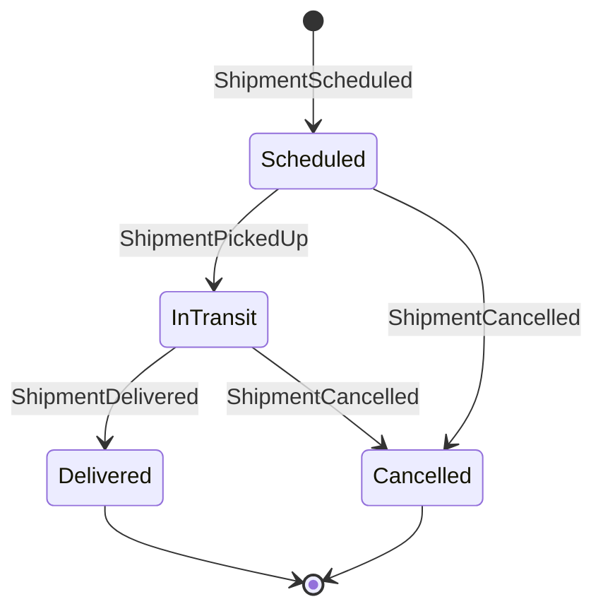

# Part 2: Evolving to Event Sourcing – Capturing Shipment Changes

To gain more insight and auditability, we decide to model the shipment lifecycle with **events**. In an event-sourced system, every change (e.g. “Shipment picked up”) is recorded as an immutable event. The current state can always be derived from the sequence of past events, and we never lose information about what happened when.

## Learning Goals

- Understand the purpose and benefits of event sourcing
- Define and store domain events
- Start and append to event streams using Marten
- Read and replay event streams to reconstruct state

## Why Event Sourcing?

Traditional systems persist the current state of data, often mutating it in place. Event sourcing flips this around: instead of storing *state*, we store *facts* — each change is captured as an immutable event.

For our delivery system, this means:

- A full audit trail of what happened and when
- The ability to rebuild state at any point
- Natural modeling of workflows and temporal logic
- Easier integration with external systems through event publishing

## Identifying Events (Event Modeling)

The first step is to define our domain events. These events should represent meaningful transitions or actions in the freight shipping process. Based on our earlier description, we have a few key moments:

- A shipment is **scheduled** (created/booked in the system).
- A shipment is **picked up** by a carrier.
- A shipment is **delivered** to its destination.
- A shipment is **cancelled** (perhaps if the order is called off).

Each of these will be an event. In naming events, a common best practice is to use past-tense verbs or descriptive phrases because events represent **something that has happened**. Also, events should carry the data relevant to that change. Let’s define our events as C# record types:

```csharp
public record ShipmentScheduled(Guid ShipmentId, string Origin, string Destination, DateTime ScheduledAt);
public record ShipmentPickedUp(DateTime PickedUpAt);
public record ShipmentDelivered(DateTime DeliveredAt);
public record ShipmentCancelled(string Reason, DateTime CancelledAt);
```

We’ve declared four event types:

- **ShipmentScheduled** – marks the creation of a shipment, including its Id, origin, destination, and when it was scheduled.
- **ShipmentPickedUp** – occurs when the shipment is collected; we capture the time of pickup.
- **ShipmentDelivered** – occurs when delivered; we capture the delivery time.
- **ShipmentCancelled** – occurs if the shipment is cancelled; we include a Reason and time of cancellation.

Why did we include `ShipmentId` in the `ShipmentScheduled` event but not in the others? In Marten (and event sourcing in general), events are stored in **streams** identified by an ID. In our case, each shipment will have its own event stream identified by the shipment’s Id. That means when we store a `ShipmentPickedUp` event, we will associate it with a specific shipment stream (so the context of which shipment it belongs to is known by the stream key). It’s not strictly necessary to duplicate the shipment Id inside every event (and often one wouldn’t), but including it in the initial “created” event can be useful for clarity or if that event might be handled independently. The key point is that Marten will ensure each event is linked to a particular Shipment aggregate.

Before coding with events, it’s useful to visualize the expected flow. Here’s a simple state diagram of our shipment lifecycle with events triggering state changes:



In this diagram, **Scheduled**, **InTransit**, **Delivered**, and **Cancelled** are states of a shipment, and the arrows show the events that transition between states. For example, when a `ShipmentPickedUp` event occurs, the shipment moves from Scheduled to InTransit. This helps ensure our events make sense and cover all transitions.

## Storing Events in Marten

Marten’s event store allows us to record these events in the database. Each shipment’s events will be stored in order within its own stream. Let’s see how to append events using Marten. We’ll simulate creating a shipment and then recording a pickup and delivery:

```csharp
using var session = store.LightweightSession();

// 1. Start a new event stream for a shipment
var shipmentId = Guid.NewGuid();
var scheduleEvent = new ShipmentScheduled(shipmentId, "Rotterdam", "New York", DateTime.UtcNow);
session.Events.StartStream<FreightShipment>(shipmentId, scheduleEvent);
await session.SaveChangesAsync();
Console.WriteLine($"Started stream {shipmentId} with ShipmentScheduled.");

// 2. Append a ShipmentPickedUp event (in a real scenario, later in time)
var pickupEvent = new ShipmentPickedUp(DateTime.UtcNow.AddHours(5));
session.Events.Append(shipmentId, pickupEvent);

// 3. Append a ShipmentDelivered event
var deliveredEvent = new ShipmentDelivered(DateTime.UtcNow.AddDays(1));
session.Events.Append(shipmentId, deliveredEvent);

// 4. Commit the new events
await session.SaveChangesAsync();
Console.WriteLine($"Appended PickedUp and Delivered events to stream {shipmentId}.");
```

Let’s break down what’s happening:

- **Starting a stream**: We call `session.Events.StartStream<FreightShipment>(shipmentId, scheduleEvent)` to begin a new event stream for a `FreightShipment` with a specific Id. The first event in this stream is `ShipmentScheduled`. Under the hood, Marten will save this event to an internal `mt_events` table (the default name) and assign it a sequence number (version 1 in the stream). We then save changes, which writes the event to the database.
- **Appending events**: Later, we load a new session (or could use the same one in a real app if still open) and use `session.Events.Append(streamId, event)` to add new events to that existing stream. We add `ShipmentPickedUp` and `ShipmentDelivered`. Notice we haven’t saved changes yet – Marten, like with documents, batches operations in the session until `SaveChangesAsync()` is called.
- **Committing events**: The second `SaveChangesAsync()` writes both the pickup and delivered events to the database in one transaction. If something went wrong (say a violation of a concurrency check), none of the events would be stored. After this, our stream has three events in order: Scheduled (version 1), PickedUp (version 2), Delivered (version 3).

At this point, the event store contains a full history for the shipment. We can retrieve the raw events if needed via Marten’s API (for example, `session.Events.FetchStream(shipmentId)` would give us all events for that stream). But more typically, we want to derive the **current state** or some useful representation from these events. That’s the role of an **aggregate** or **projection**, which we’ll explore next.
