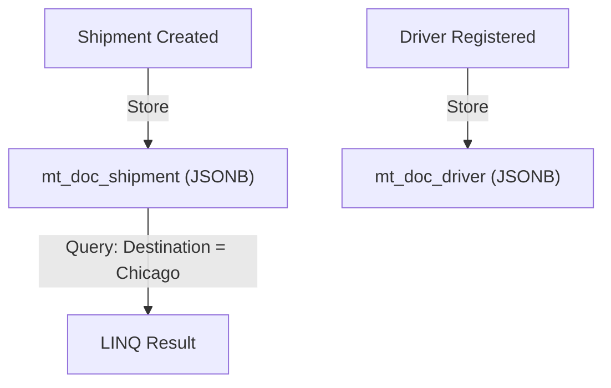

# Modeling documents

In this chapter, we'll define the domain model for our freight and delivery system and store it in PostgreSQL using Marten as a document database.

## Learning Goals

- Design C# document types (`Shipment`, `Driver`)
- Store documents using Marten
- Query documents using LINQ
- Understand Marten's identity and schema conventions

## Defining Documents

We'll start by modeling two core entities in our domain: `Shipment` and `Driver`.

<<< @/src/samples/FreightShipping/ModelingDocuments.cs#models

> Marten uses `Id` as the primary key by convention. No attributes or base classes are required.

Once defined, Marten will automatically create tables like `mt_doc_shipment` and `mt_doc_driver` with a `jsonb` column to store the data.

## Storing Documents

<<< @/src/samples/FreightShipping/ModelingDocuments.cs#storing-documents

Marten uses PostgreSQL's `INSERT ... ON CONFLICT DO UPDATE` under the hood to perform upserts.

## Querying Documents

Use LINQ queries to fetch or filter data:

<<< @/src/samples/FreightShipping/ModelingDocuments.cs#querying-documents

> You can also project into DTOs or anonymous types for performance if you don’t need the full document.

## Indexing Fields for Performance

If you frequently query by certain fields, consider duplicating them as indexed columns:

<<< @/src/samples/FreightShipping/ModelingDocuments.cs#indexing-fields

This improves query performance by creating indexes on those columns outside the JSON.

## Visual Recap

## Summary

- Documents are plain C# classes with an `Id` property
- Marten stores them in PostgreSQL using `jsonb`
- You can query documents using LINQ
- Index fields you query often for better performance

::: info
You can access the source code of [FreightShipping tutorial](https://github.com/JasperFx/marten/tree/cfff44de42b099f4a795dbb240c53fc4d2cb1a95/docs/src/samples/FreightShipping) on GitHub.
:::
