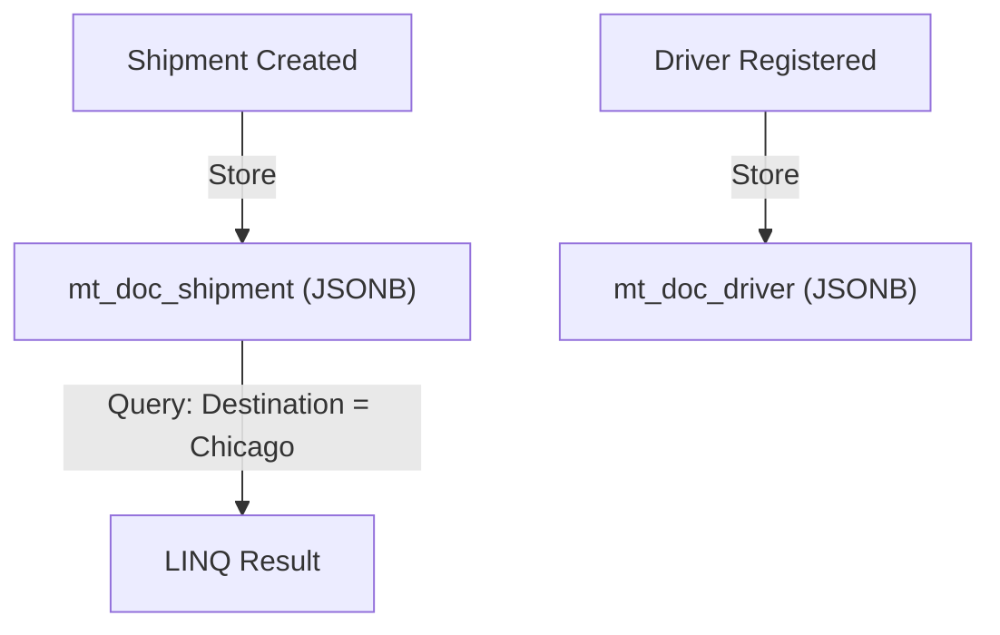

# Modeling documents

In this chapter, we'll define the domain model for our freight and delivery system and store it in PostgreSQL using Marten as a document database.

---

## Learning Goals

- Design C# document types (`Shipment`, `Driver`)
- Store documents using Marten
- Query documents using LINQ
- Understand Marten's identity and schema conventions

---

## Defining Documents

We'll start by modeling two core entities in our domain: `Shipment` and `Driver`.

```csharp
public class Shipment
{
    public Guid Id { get; set; }
    public string Origin { get; set; }
    public string Destination { get; set; }
    public DateTime CreatedAt { get; set; }
    public DateTime? DeliveredAt { get; set; }
    public string Status { get; set; }
    public Guid? AssignedDriverId { get; set; }
}

public class Driver
{
    public Guid Id { get; set; }
    public string Name { get; set; }
    public string LicenseNumber { get; set; }
}
```

> Marten uses `Id` as the primary key by convention. No attributes or base classes are required.

Once defined, Marten will automatically create tables like `mt_doc_shipment` and `mt_doc_driver` with a `jsonb` column to store the data.

---

## Storing Documents

```csharp
var shipment = new Shipment
{
    Id = Guid.NewGuid(),
    Origin = "New York",
    Destination = "Chicago",
    CreatedAt = DateTime.UtcNow,
    Status = "Created"
};

var driver = new Driver
{
    Id = Guid.NewGuid(),
    Name = "Alice Smith",
    LicenseNumber = "A123456"
};

using var session = store.LightweightSession();
session.Store(driver);
session.Store(shipment);
await session.SaveChangesAsync();
```

Marten uses PostgreSQL's `INSERT ... ON CONFLICT DO UPDATE` under the hood to perform upserts.

---

## Querying Documents

Use LINQ queries to fetch or filter data:

```csharp
using var querySession = store.QuerySession();

// Load by Id
var existingShipment = await querySession.LoadAsync<Shipment>(shipment.Id);

// Filter by destination
var shipmentsToChicago = await querySession
    .Query<Shipment>()
    .Where(x => x.Destination == "Chicago")
    .ToListAsync();

// Count active shipments per driver
var active = await querySession
    .Query<Shipment>()
    .CountAsync(x => x.AssignedDriverId == driver.Id && x.Status != "Delivered");
```

> You can also project into DTOs or anonymous types for performance if you don’t need the full document.

---

## Indexing Fields for Performance

If you frequently query by certain fields, consider duplicating them as indexed columns:

```csharp
opts.Schema.For<Shipment>().Duplicate(x => x.Status);
opts.Schema.For<Shipment>().Duplicate(x => x.AssignedDriverId);
```

This improves query performance by creating indexes on those columns outside the JSON.

---

## Visual Recap



---

## Summary

- Documents are plain C# classes with an `Id` property
- Marten stores them in PostgreSQL using `jsonb`
- You can query documents using LINQ
- Index fields you query often for better performance
