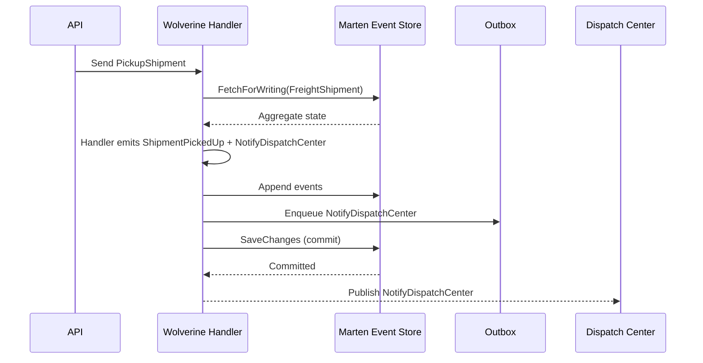

# Part 6: Integrating Marten with Wolverine

Marten and Wolverine are a powerful combination for building reliable, distributed, and event-driven systems. Marten handles persistence (documents and events), while Wolverine provides messaging, transactional outbox/inbox support, background processing, and distributed coordination.

This integration serves **two distinct purposes**:

1. Event-driven messaging and transactional command handling
2. Coordinated background projection processing in distributed environments

## Reliable Messaging with Aggregates

When using event sourcing, emitting events from domain aggregates is common — and often, we want to trigger side effects (notifications, follow-up commands, integration events). With just Marten, you'd need to handle messaging yourself, risking lost messages in case of failure.

With Wolverine:

- You can use `[AggregateHandler]` to define aggregate command handlers.
- Events and messages returned from the handler are **saved and dispatched atomically**.
- Wolverine uses **Marten’s outbox** to store messages until the transaction commits.

Example:

```csharp
[AggregateHandler]
public static IEnumerable<object> Handle(PickupShipment cmd, FreightShipment shipment)
{
    if (shipment.Status != ShipmentStatus.Scheduled)
        throw new InvalidOperationException("Cannot pick up unscheduled shipment");

    yield return new ShipmentPickedUp(cmd.Timestamp);
    yield return new NotifyDispatchCenter(shipment.Id, "PickedUp");
}
```

Wolverine will:

1. Load the `FreightShipment` using `FetchForWriting` (for optimistic concurrency)
2. Pass the current aggregate and command to the handler
3. Append the returned events to the stream
4. Save the session
5. Dispatch messages after commit

The outbox ensures **exactly-once** messaging. The inbox can guarantee that incoming messages are processed **only once**, even across retries.

### Distributed Projections in Multi-Node Environments

If you run your freight system across multiple nodes (e.g. for horizontal scaling or redundancy), Marten’s async projection daemon needs coordination — to avoid multiple nodes processing the same projection.

Wolverine offers cluster-wide coordination:

- Only one node will run each async projection or event subscription.
- If a node fails, projection work is reassigned.
- You can configure **load balancing** and **capability-based projection routing** (e.g., for blue/green deployments).

Configuration:

```csharp
builder.Services.AddMarten(opts =>
{
    opts.Connection(connectionString);
    opts.Projections.Add<FreightShipmentProjection>(ProjectionLifecycle.Async);
    opts.Projections.Add<DailyStatsProjection>(ProjectionLifecycle.Async);
})
.IntegrateWithWolverine(cfg =>
{
    cfg.UseWolverineManagedEventSubscriptionDistribution = true;
});
```

This ensures that your projection daemon is managed by Wolverine’s distributed coordinator.

### Summary

- **Messaging + Aggregates**: Wolverine makes it easy to process commands, generate events, and send follow-up messages, all with transactional guarantees.
- **Cluster-safe Projections**: In distributed deployments, Wolverine ensures that async projections are safely coordinated.
- **Inbox/Outbox**: Wolverine ensures exactly-once delivery semantics across your freight and delivery system.

Together, Marten and Wolverine give you a solid foundation for a consistent, reliable freight management system — with minimal boilerplate and maximum safety.


