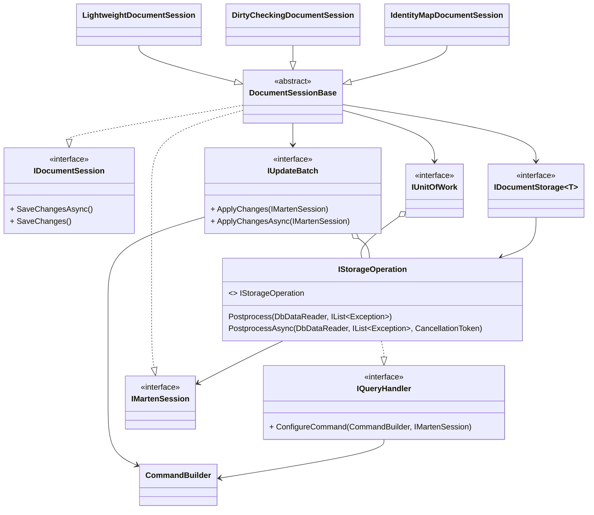
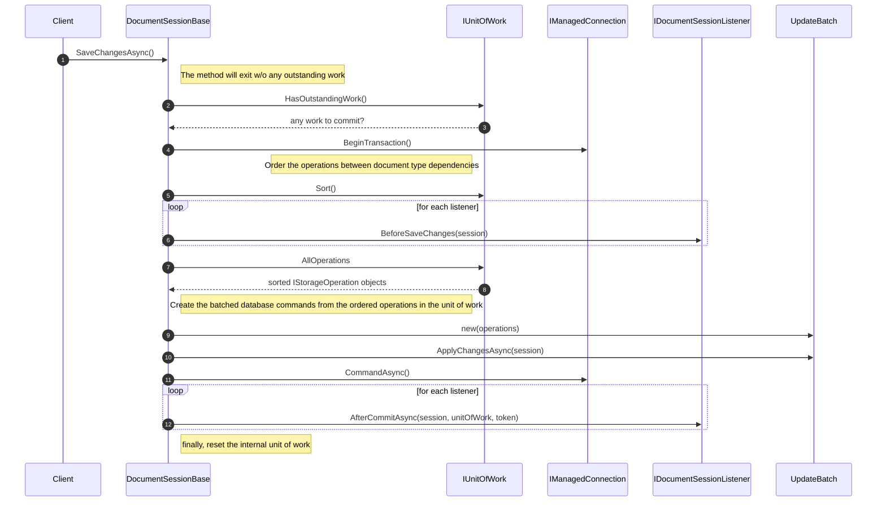
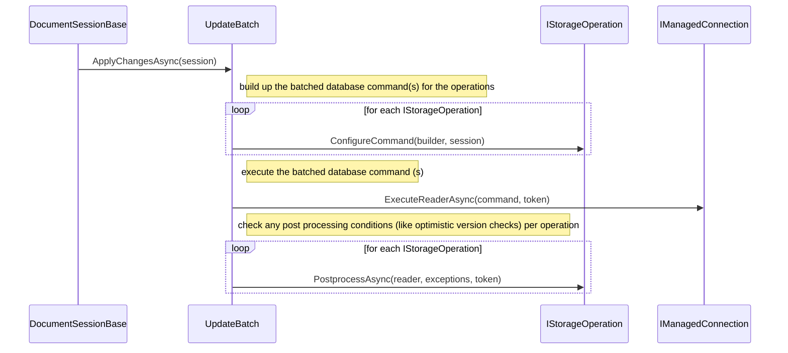

## Document Storage Class Diagram

Notes:

* `IUnitOfWork` tracks all the outstanding operations (updates, upserts, deletes, append/create events) for the current `DocumentSessionBase`
* `IDocumentStorage<T>` classes are generated and compiled at runtime by Marten by document type *and* by session type (query only, lightweight, identity map, dirty checking). 
* `IStorageOperation` classes are also generated and compiled at runtime by Marten for document types. This interface effectively represents a single SQL statement to be executed as well as any
postprocessing like optimistic concurrency checks or version assignments
* `IUpdateBatch` is just a helper to execute an array of `IStorageOperation` objects in a single transaction and one or more batched database commands
* `IMartenSession` is an internal interface that's new in Marten V4 that is used to execute query operations. All `QuerySession` and `DocumentSessionBase` classes in Marten also implement `IMartenSession`
* `CommandBuilder` is a utility class to build up SQL statements

## IDocumentSession.SaveChangesAsync() Sequence Diagram

This diagram omits the event appending workflow. That will be shown
in another document.

## Internals of UpdateBatch

