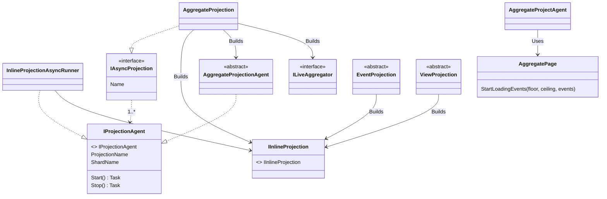
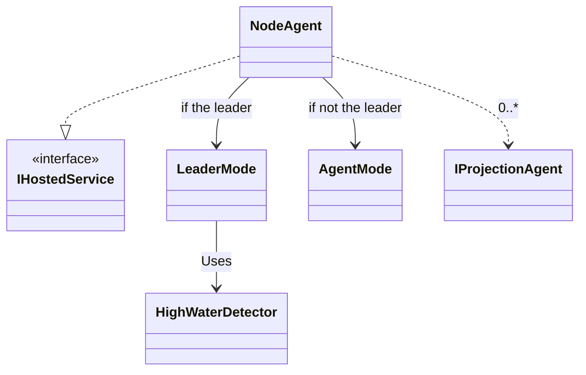

# V4 Event Store Architecture

This is all heavily in flight! The big goals for V4 are:

* Make everything *faster* with a capital "F"
* Easier usage of custom projections
* Consolidate the options for user-defined projections
* The async projection support should have higher throughput, support rebuilds without any downtime, be able to manage itself out of the box in application clusters, and be able to deal with multi-tenancy

## Projection Class Diagram

Notes:

The proposal is that Marten will support these mechanisms for users to **define** a projection:

1. "Self-aggregating Aggregates" like we do today (see [QuestParty](https://github.com/JasperFx/marten/blob/master/src/Marten.Testing/Events/Projections/QuestParty.cs)), but V4 will only support this pattern for live aggregations
1. `EventProjection` will be the "anything goes" alternative that allows you to do any kind of operation by directly using the new `IDocumentOperations` interface (a subset of `IDocumentSession`) to take actions based on events, event metadata, or persisted state. This will support a mix of inline Lambdas and conventional methods like `void Project(MonsterSlayed slayed, IDocumentOperations operations)`. This option will also support the ability to execute arbitrary SQL
1. `ViewProjection<TDoc, TId>` will support creating/updating/deleting a single projected view type across an arbitrary collection of events. This is what Jeremy has called the "aggregate across streams" option. The API will be a rewritten *subset* version of today's `ViewProjection` with all new internals. This will support a mix of inline Lambdas like the current `ViewProjection` as well as conventional methods.
1. `AggregateProjection<T>` will be specifically for projected views that are aggregated across events. This should support either an aggregate across streams, or a user-defined grouping across different streams. This will support both inline Lambdas and conventiona methods
1. Users can directly implement the `IInlineProjection` interface as a "do anything you possibly want" alternative. So if you just wanna use C# pattern matching, you could do this. 
1. Users could maybe write their own implementation of `ILiveAggregator<T>` to do on the fly, "live" aggregation. Not sure why you'd want to do that, but it'd still be possible

More notes:

* Users will still have to explicitly register projections as either async or inline with the same syntax as today
* `ViewProjection` and `AggregateProjection` types *define* a projection. Both will generate an implementation of `IInlineProjection` if they're configured to run "inline". 
* `ViewProjection` and `AggregateProjection` will both share quite a bit of code in the async daemon mode
* If used asynchronously, the `AggregateProjection` or `ViewProjection` will generate an `IProjectionAgent` to most efficiently run as part of the V4 version of the async daemon
* If used asynchronously, any `IInlineProjection` class, including implementations generated at runtime for `EventProjection`, will be executed through a new 
  `InlineProjectionAsyncRunner` class that acts as an adapter to plug an inline projection into an `IProjectionAgent` for the new async daemon
* If the aggregate type "T" of an `AggregateProjection<T>` is used for a live aggregation, `AggregateProjection` will generate and compile an instance of `ILiveAggregator<T>`

## Leader Election

Goals:

* Make the async daemon run across an application cluster
* Allow the async daemon to distribute work across the cluster in the case of having multiple async projections
* Support the idea of "sharding" a single projection so that building it inside the async daemon could be parallelized either on one single box or throughout the application cluster.
* Make the daemon fail over automatically when a node running asynchronous projects goes offline

To run the new asynchronous projection support across an application cluster, we'll likely need to use some kind of [leader election](https://en.wikipedia.org/wiki/Leader_election) so that the async daemon running across a cluster only has one single node that is responsible for distributing work across the rest of the cluster. To pull this off, I suggest using the [bully algorithm](https://en.wikipedia.org/wiki/Bully_algorithm). Some thoughts about how to pull that off:

* Whenever a new node comes online, the startup of the async daemon should go write a record into a new table we'll use to track active daemon nodes. The PK of that table will be an integer assigned by a new Postgresql Sequence, so each running instance will always have a new unit id. 
* The "bully algorithm" in this case should always try to assign the leader responsibility to the oldest running node
* We'll heavily use [advisory locks](https://hashrocket.com/blog/posts/advisory-locks-in-postgres) as a way to have each node keep a "lock" on itself. We'll use advisory locks to ensure that only one node can possibly be doing projection assignments. 
* Each node will be constantly try to take away the advisory lock for other known nodes and the leader process. This is a way to "know" if another node has fallen offline
* A node should release its own advisory lock on its node id and delete the node record for itself on graceful shutdowns

## Async Daemon Class Diagram

To be clear, I'm advocating for a ground up re-write of the existing async daemon. Keep some of the end to end tests, but junk the rest of it. We should probably all discuss that more:)

Notes:

* We can get easy integration with Marten V4's new async daemon and a .Net Core / .Net 5 application by using the `IHostedService` interface and
  having the async daemon services be registered into the application's IoC container
* The `NodeAgent` (could rename that to `ProjectionDaemon` maybe) will be the controller for the asynchronous projections within one running application node
* As a large departure from the current async daemon, I propose that we separate out the responsibility for detecting the "high water" mark for the events table to a separate, new polling class called `HighWaterDetector` that will only run on the leader node and will write the new high water mark to the existing `mt_event_progression` table where it can be read by any other node. The new high water detection could use a [window function]() to find where there are gaps in the event table `seq_id` table and "know" the leading edge of events that are safe to be processed without missing outstanding work. I'm hopeful that the new "tombstone" event workflow for failed transactions drastically reduces the sequence gap problems that bedeviled the current async daemon, but we'll still make it resilient enough to determine when missing sequence numbers are likely to never be filled in so the projections can proceed on again. More research and spiking necessary here.
* The projections should be "shardable" by user definitions so that parts of the projection could be parallelized and even run over multiple nodes. Maybe we could shard by tenants, a range of tenants, or something else. *More thought necessary here*

