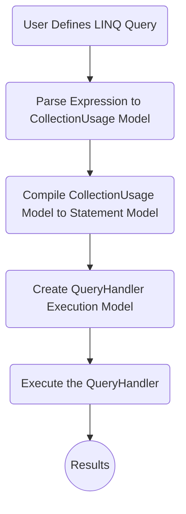
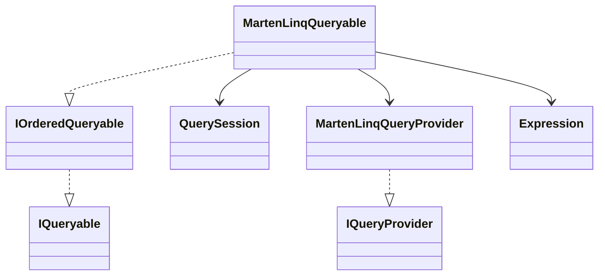
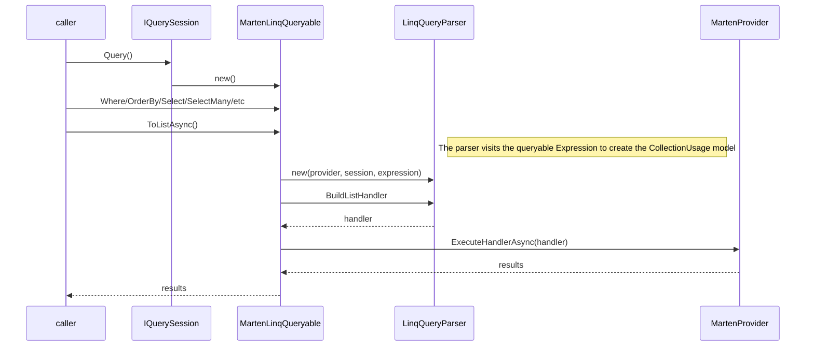
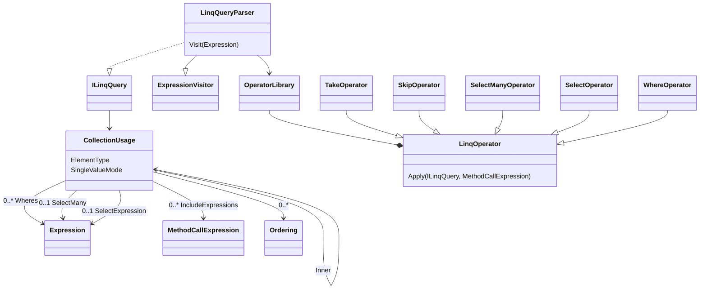
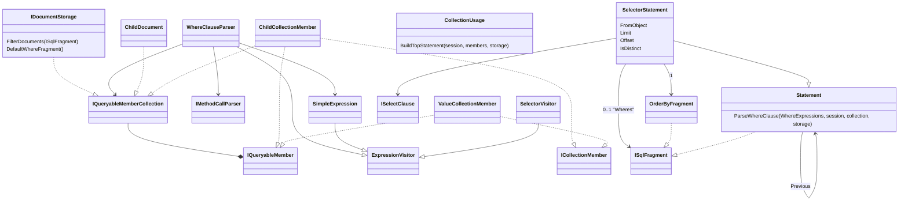
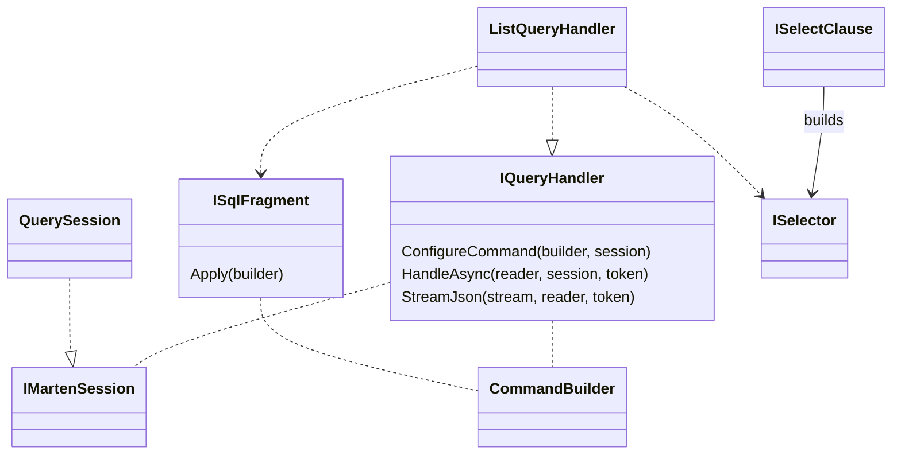
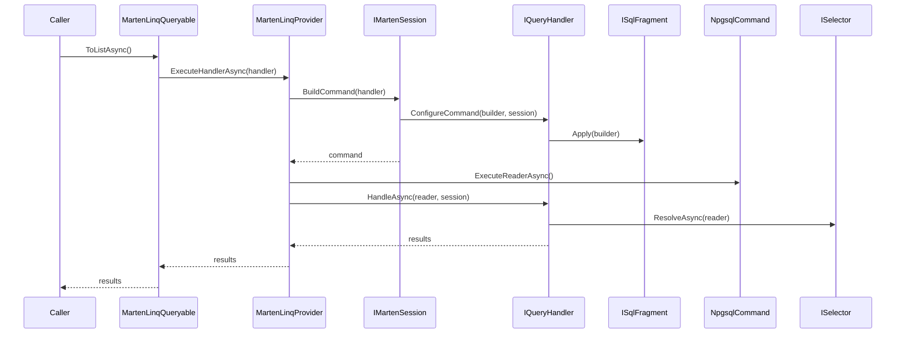

# Marten LINQ Notes

A LINQ provider is an awesomely useful arrow in the .NET quiver, and arguably the one single thing that .NET has for development that no
other ecosystem can truly match. That said, it's also an unholy nightmare for us, the maintainers of Marten, to adequately support.
This guide is attempting to explain the LINQ subsystem for whoever is brave enough to delve into the LINQ support for whatever random
"why would you try to do that?" use case that's currently broken.

## Very Basic Workflow

Creating and executing a single LINQ statement like:

```csharp
var results = await session.Query<Target>().Where(x => x.Number == 5).OrderBy(x => x.String).ToListAsync();
```

results in this multi-step process:



All told, the LINQ provider consists of these related models:

* The entrypoint `IQueryable` implementation that Marten users will interact with
* The `CollectionUsage` intermediate model that organizes the raw `Expression` into Select/Where/OrderBy/Take/Skip/SelectMany/Include steps
* The `Statement` model that "knows" how to generate the SQL for the LINQ expression and to read the raw data into the right results
* The `IQueryHandler` model that uses the `Statement` model to execute the query and return results

## Entry Point Model

The entry point for all LINQ queries with Marten is the `MartenLinqQueryable<T>` class. As users make subsequent calls to chain
operators on `MartenLinqQueryable<T>` the internal .NET LINQ mechanics are
creating one big [Expression](https://learn.microsoft.com/en-us/dotnet/api/system.linq.expressions.expression?view=net-8.0) model, that will later be parsed to create a query handler.



The high level flow is to take the configured `MartenLinqQueryable` object, parse its related `Expression` into the Marten `IQueryHandler` model, then execute that handler like so:



## Parsing to CollectionUsage

The first pass of LINQ parsing is to merely organize the overall LINQ `Expression` into `CollectionUsage` object representing the usage of one or more document collections (the top level document collection and potential usages of `SelectMany()` clauses). Do note that the parsing is done right to left or really, outer to inner in the typical chained LINQ expression.



## Compiling to Statement Model

The translation step to compile the `CollectionUsage` model and bits and bobs of the `Expression` elements to an executable `Statement` is the
most complex part of the LINQ provider.



Some notes:

* `SimpleExpression` is a generic helper to parse "simple" expressions like either side of a Where expression like `x.Name == "Chewie"`, and also helps create `ISqlFragment` objects for binary comparisons of one `SimpleExpression` to another
* `IQueryableMember` represents a usable field (or duplicated field) inside the serialized JSON document body, and memoizes information about locators. We encapsulate
  variable type specific handling in the implementations of this interface
* The `Statement` model is a double linked list structure. Most LINQ queries can be done with one statement, but more complex queries within child collections, `Include()` operator usage, or `SelectMany()` usage will force Marten to need multiple SQL statements. `Distinct()` will frequently require the usage of multiple statements as well

## Execution Model

Actually executing the LINQ query revolves around Marten's `IQueryHandler<T>` interface. Taking the example
of a `ToList() / ToListAsync()` operation, the execution model is shown below. Note that the `ISqlFragment` model comes
from Weasel, and can be generically used for basically any object that contributes to generating a SQL statement.



At runtime, the execution at a high level is to first generate the SQL command, then
execute that command and interpret the results:




